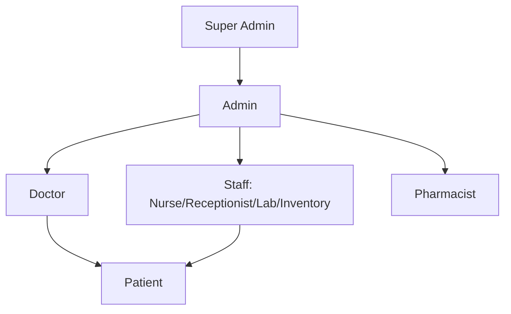
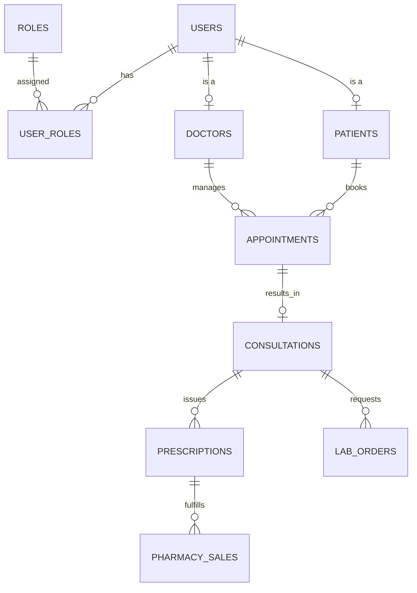
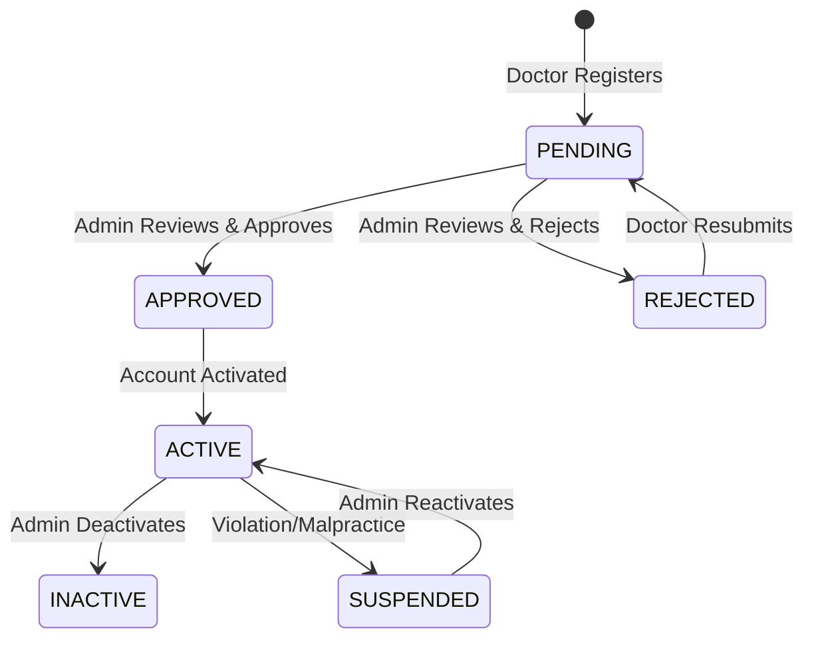
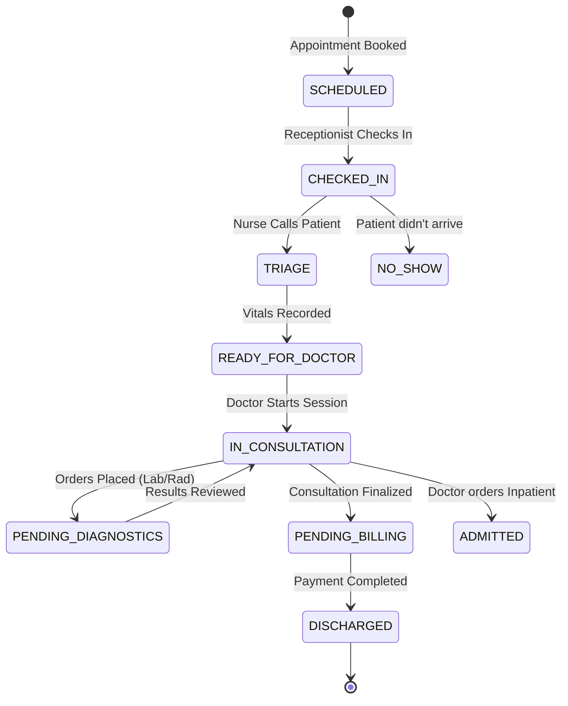

# HMS

### 🏥 Market Exploration: Existing HMS Products

Before designing, it is crucial to understand the market leaders to ensure our system meets industry standards:

1. **Epic & Oracle Health (Cerner)**: The enterprise gold standards. *Takeaway*: Deep interoperability (HL7/FHIR), unified patient records, and robust audit trails are non-negotiable.
2. **Athenahealth**: Cloud-native, strong patient engagement. *Takeaway*: Patient portals and seamless communication workflows are highly valued.
3. **OpenMRS**: Open-source, highly modular. *Takeaway*: Proves that a modular, metadata-driven architecture works well for complex healthcare workflows.
4. **Practo / 1mg (Emerging Markets)**: Strong integration of telemedicine, pharmacy, and lab aggregators. *Takeaway*: Pharmacy and Lab modules must be tightly coupled with Doctor consultations for revenue generation.

---

### 1. Complete HMS Overview

The proposed **Hospital Management System (HMS)** is a comprehensive, secure, and scalable platform designed to digitize end-to-end hospital operations. Built on a **Modular Monolithic Architecture**, it ensures rapid initial development while maintaining strict bounded contexts for future microservices extraction. It unifies clinical workflows (Doctors, Patients, Labs) with operational workflows (Pharmacy, Inventory, Billing) under a single source of truth.

### 2. Role Hierarchy



### 3. Role Permissions Matrix

| Module | Super Admin | Admin | Doctor | Receptionist | Pharmacist | Lab Staff | Inventory | Patient |
| --- | --- | --- | --- | --- | --- | --- | --- | --- |
| **System Config** | Full | Read | - | - | - | - | - | - |
| **User/Staff Mgmt** | Full | Full | - | - | - | - | - | - |
| **Doctor Approval** | Full | Full | Read(Own) | - | - | - | - | - |
| **Appointments** | Read | Full | Manage(Own) | Book/Cancel | - | - | - | Book(Own) |
| **Consultations** | Read | Read | Full | - | - | - | - | Read(Own) |
| **Pharmacy/Inventory** | Read | Read | Read | - | Full | - | Full | Read(Own) |
| **Laboratory** | Read | Read | Req/View | - | - | Full | - | View(Own) |
| **Billing/Payments** | Read | Full | View | Generate | Generate | - | - | Pay/View |

### 4. Complete Module List

1. Identity & Access Management (IAM)
2. User & Staff Management
3. Doctor Management
4. Patient Management
5. Appointment & Queue Management
6. Consultation & EMR (Electronic Medical Records)
7. Pharmacy & Dispensing
8. Laboratory & Diagnostics
9. Inventory & Supply Chain
10. Billing & Financials
11. Notification & Communication
12. Reporting & Analytics
13. Audit & Security

### 5. Module-wise Features

- **IAM**: Keycloak/Spring Security integration, JWT, RBAC, MFA.
- **Doctor Mgmt**: Registration, document upload, approval workflow, scheduling, profile.
- **Patient Mgmt**: Registration, medical history, insurance details, emergency contacts.
- **Appointments**: Booking, rescheduling, queue management, calendar views.
- **Consultation**: Vitals entry, diagnosis (ICD-10), e-prescriptions, lab test ordering.
- **Pharmacy**: Medicine catalog, batch/expiry tracking, FEFO dispensing, POS billing.
- **Laboratory**: Test catalogs, sample tracking (barcode), result entry, report generation.
- **Inventory**: Suppliers, POs, GRN, stock transfers, FEFO alerts, destruction.
- **Billing**: Consolidated invoicing (Consult + Lab + Pharma), payment gateways, refunds.

### 6. Complete Workflows

**Patient Journey**: Registration → Book Appointment → Check-in (Reception) → Doctor Consultation → (If needed) Lab Test & Pharmacy → Billing → Payment → Discharge.
**Admin Journey**: Doctor Applies → Uploads Docs → Admin Reviews → Approves/Rejects → Doctor Activated.

### 7. Database ER Diagram Description

The database is normalized to 3NF. Core entities revolve around `USERS`, which branches into specific profiles (`DOCTORS`, `PATIENTS`, `STAFF`). Clinical events (`APPOINTMENTS`, `CONSULTATIONS`) link doctors and patients. Operational entities (`MEDICINES`, `INVENTORY`, `LAB_TESTS`) support the clinical workflows. Financial entities (`INVOICES`, `PAYMENTS`) track revenue.



### 8. Database Tables (Core Schema)

*Missing tables identified and added: `doctor_schedules`, `medical_records`, `inventory_transactions`.*

| Table Name | Key Columns | Relationships / Constraints |
| --- | --- | --- |
| **users** | id, username, password_hash, email, phone, status | PK: id. Unique: username, email |
| **roles** | id, name, description | PK: id. Unique: name |
| **user_roles** | user_id, role_id | FK: users(id), roles(id). PK: (user_id, role_id) |
| **doctors** | id, user_id, specialization, license_no, consultation_fee, approval_status | FK: users(id). Unique: license_no |
| **doctor_documents** | id, doctor_id, doc_type, file_url, verified | FK: doctors(id) |
| **patients** | id, user_id, dob, gender, blood_group, address | FK: users(id) |
| **appointments** | id, patient_id, doctor_id, date, time, status | FK: patients(id), doctors(id) |
| **consultations** | id, appointment_id, doctor_id, patient_id, diagnosis, notes | FK: appointments(id), doctors(id), patients(id) |
| **prescriptions** | id, consultation_id, date, notes | FK: consultations(id) |
| **prescription_items** | id, prescription_id, medicine_id, dosage, qty | FK: prescriptions(id), medicines(id) |
| **medicines** | id, name, category, manufacturer, unit_price | PK: id |
| **medicine_batches** | id, medicine_id, batch_no, expiry_date, qty_in_stock | FK: medicines(id). Unique: (medicine_id, batch_no) |
| **lab_tests** | id, name, category, price, normal_range | PK: id |
| **lab_orders** | id, consultation_id, patient_id, status | FK: consultations(id), patients(id) |
| **lab_results** | id, lab_order_id, test_id, result_value, status | FK: lab_orders(id), lab_tests(id) |
| **inventory** | id, item_name, category, reorder_level, current_stock | PK: id |
| **suppliers** | id, name, contact, email, address | PK: id |
| **invoices** | id, patient_id, total_amount, status, created_at | FK: patients(id) |
| **payments** | id, invoice_id, amount, method, transaction_ref | FK: invoices(id) |
| **audit_logs** | id, user_id, action, entity, entity_id, timestamp | FK: users(id) |

### 9. REST API List (Sample)

| Method | Endpoint | Description | Role |
| --- | --- | --- | --- |
| POST | `/api/auth/login` | Authenticate & get JWT | Public |
| POST | `/api/doctors/register` | Doctor self-registration | Doctor |
| GET | `/api/admin/doctors/pending` | Get pending approvals | Admin |
| PUT | `/api/admin/doctors/{id}/approve` | Approve doctor | Admin |
| POST | `/api/appointments/book` | Book appointment | Patient/Reception |
| POST | `/api/consultations/{id}/prescribe` | Issue prescription | Doctor |
| POST | `/api/pharmacy/dispense` | Dispense medicine (FEFO) | Pharmacist |
| GET | `/api/labs/orders/{id}/results` | Get lab results | Doctor/Patient |

### 10. Spring Boot Architecture (Modular Monolith)

**Package Structure:**

```
com.hms
├── common/          # Shared DTOs, Utils, Exceptions, Security
├── auth/            # Login, JWT, Keycloak integration
├── users/           # User, Role, Staff management
├── doctors/         # Doctor profile, approvals, schedules
├── patients/        # Patient profiles, medical history
├── appointments/    # Booking, queue management
├── clinical/        # Consultations, Prescriptions, EMR
├── pharmacy/        # Medicines, Batches, Dispensing
├── laboratory/      # Tests, Orders, Results
├── inventory/       # Stock, Suppliers, POs
├── billing/         # Invoices, Payments
└── notifications/   # Email, SMS, Push
```

**Modular Monolith to Microservices Migration:**
Because the code is strictly separated by bounded contexts (e.g., `pharmacy` cannot directly access `inventory`'s JPA repositories, only its public service interfaces), migrating to microservices later simply requires:

1. Extracting each module into a separate Spring Boot project.
2. Replacing internal service calls with REST/gRPC or RabbitMQ events.
3. Splitting the single MySQL database into schema-per-service or separate DB instances.

### 11. React Architecture (Feature-Based)

```
src/
├── assets/          # Images, global CSS
├── components/      # Shared UI (Buttons, Modals, Tables)
├── features/        # Feature-based modules
│   ├── auth/        # Login, Register, Forgot Password
│   ├── admin/       # Admin dashboards, user management
│   ├── doctor/      # Doctor dashboard, consultations
│   ├── patient/     # Patient portal, appointments
│   ├── pharmacy/    # POS, inventory management
│   └── lab/         # Sample tracking, result entry
├── hooks/           # Custom React hooks
├── services/        # Axios API clients
├── store/           # Redux Toolkit slices
├── routes/          # Protected routes, role-based routing
└── utils/           # Helpers, formatters
```

### 12. Authentication and Authorization Flow

1. User submits credentials to `/api/auth/login`.
2. Spring Security validates against DB (BCrypt).
3. Server generates Access Token (15 min) and Refresh Token (7 days).
4. Tokens returned in HttpOnly cookies (or secure headers).
5. Frontend intercepts requests via Axios, attaching the JWT.
6. Spring Security Filter validates JWT, extracts `userId` and `roles`.
7. `@PreAuthorize("hasRole('DOCTOR')")` or custom `PermissionEvaluator` checks access at the controller/service level.

### 13. Doctor Approval Workflow



### Patient Visit State Machine (Status Lifecycle)



---

### 💡 Key System Automations

### 14. Admin Dashboard

- **Stats**: Total Patients, Active Doctors, Today's Appointments, Revenue (Today/Month).
- **Charts**: Patient footfall trend, Department-wise revenue.
- **Alerts**: Pending Doctor Approvals, Low Inventory Alerts, Expiring Medicines.
- **Quick Actions**: Add Staff, Approve Doctor, View Audit Logs.

### 15. Doctor Dashboard

- **Stats**: Today's Appointments, Pending Lab Reports, Total Prescriptions Issued.
- **Queue**: Live list of checked-in patients waiting.
- **Calendar**: Upcoming appointments for the week.
- **Quick Actions**: Start Consultation, View Patient History.

### 16. Patient Dashboard

- **Stats**: Upcoming Appointments, Active Prescriptions, Pending Payments.
- **Health**: Recent Vitals, Allergies, Blood Group.
- **Quick Actions**: Book Appointment, Download Lab Report, Pay Bill.

### 17. Pharmacy Workflow

1. Doctor issues e-prescription.
2. Prescription routes to Pharmacy Queue.
3. Pharmacist reviews. System auto-allocates batches via **FEFO** (First-Expired, First-Out).
4. Pharmacist confirms dispensing.
5. Inventory deducts stock; Ledger records cost.
6. Bill generated and added to patient's consolidated invoice.

### 18. Laboratory Workflow

1. Doctor orders lab tests during consultation.
2. Order appears in Lab Queue.
3. Lab Staff collects sample, generates barcode, marks `COLLECTED`.
4. Sample processed, results entered, marked `COMPLETED`.
5. Results auto-route to Doctor's inbox and Patient's portal.

### 19. Inventory Workflow

1. System detects stock below reorder level (or Admin initiates).
2. Purchase Order (PO) created and sent to Supplier.
3. Goods received: Staff enters Batch No, Expiry, Qty (Goods Receipt Note).
4. Stock updated, Landed Cost calculated, Ledger updated.

### 20. Billing Workflow

1. Services rendered (Consult, Lab, Pharmacy) add line items to a temporary "Patient Cart".
2. Receptionist/Cashier opens consolidated invoice.
3. Discounts/Insurance adjustments applied.
4. Payment processed (Cash/Card/Insurance).
5. Invoice marked `PAID`, receipt generated.

### 21. Notification Workflow

- **Triggers**: Appointment booked, Lab result ready, Stock low.
- **Routing**: Event published to internal bus.
- **Execution**: Notification service reads user preferences and sends via Email (SendGrid), SMS (Twilio), or In-App WebSocket.

### 22. Audit Logging

Implemented via Spring AOP (Aspect-Oriented Programming). A custom `@Auditable` annotation on service methods intercepts calls, capturing `userId`, `action`, `entityName`, `entityId`, `oldValue`, `newValue`, and `timestamp`, writing asynchronously to the `audit_logs` table.

### 23. Validation and Exception Handling

- **Validation**: Jakarta Validation (`@Valid`, `@NotNull`, `@Email`) on DTOs.
- **Exception Handling**: Global `@RestControllerAdvice`. Custom exceptions (e.g., `ResourceNotFoundException`, `UnauthorizedException`) mapped to standard HTTP status codes (404, 401, 400) with a unified JSON error response structure.

### 24. Security Considerations

- **Data at Rest**: Sensitive fields (like medical notes) encrypted at DB level if required. Passwords hashed with BCrypt.
- **Data in Transit**: TLS 1.3 enforced.
- **API Security**: Rate limiting via Kong/Spring Cloud Gateway. CORS strictly configured.
- **Compliance**: HIPAA/GDPR readiness via strict RBAC, audit logs, and data anonymization features.

[Workflows](HMS/Workflows%203cb484c9eafb8096bc35e1fc35d35519.md)

[Patient Management](HMS/Patient%20Management%203cb484c9eafb80149f72f747c596f098.md)

[Staff Management ](HMS/Staff%20Management%203cb484c9eafb806aaf64d275d0ba8eb9.md)

[Doctor Management](HMS/Doctor%20Management%203cb484c9eafb80c981c0db73bafecbce.md)

[Appointment & Queue Management](HMS/Appointment%20&%20Queue%20Management%203cb484c9eafb80efaad8c44868ce9c37.md)

[Consultation & EMR (Electronic Medical Records)](HMS/Consultation%20&%20EMR%20(Electronic%20Medical%20Records)%203cb484c9eafb80339505f3fa27b737fd.md)

[Pharmacy & Dispensing](HMS/Pharmacy%20&%20Dispensing%203cb484c9eafb800cbd0bdf5169b36878.md)

[Laboratory & Diagnostics](HMS/Laboratory%20&%20Diagnostics%203cb484c9eafb801e9d4bf393751dae63.md)

[Inventory & Supply Chain](HMS/Inventory%20&%20Supply%20Chain%203cb484c9eafb80c997a6f1c1d7aeaa31.md)

[Billing & Financials](HMS/Billing%20&%20Financials%203cb484c9eafb800193add70b15caf389.md)

[Pharmacy Workflow](HMS/Pharmacy%20Workflow%203cb484c9eafb804c9bb9ff6da182cf83.md)