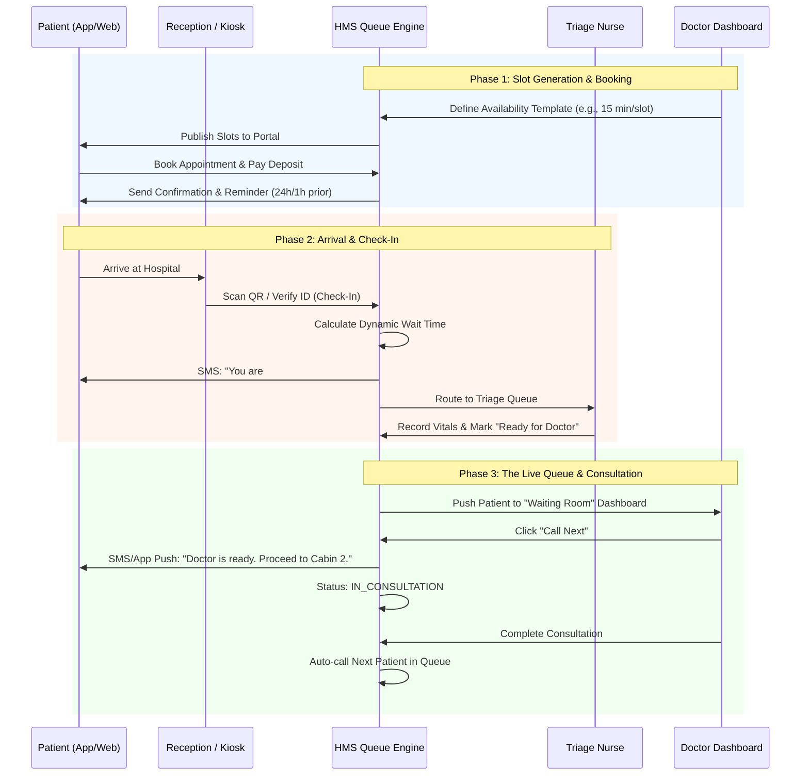
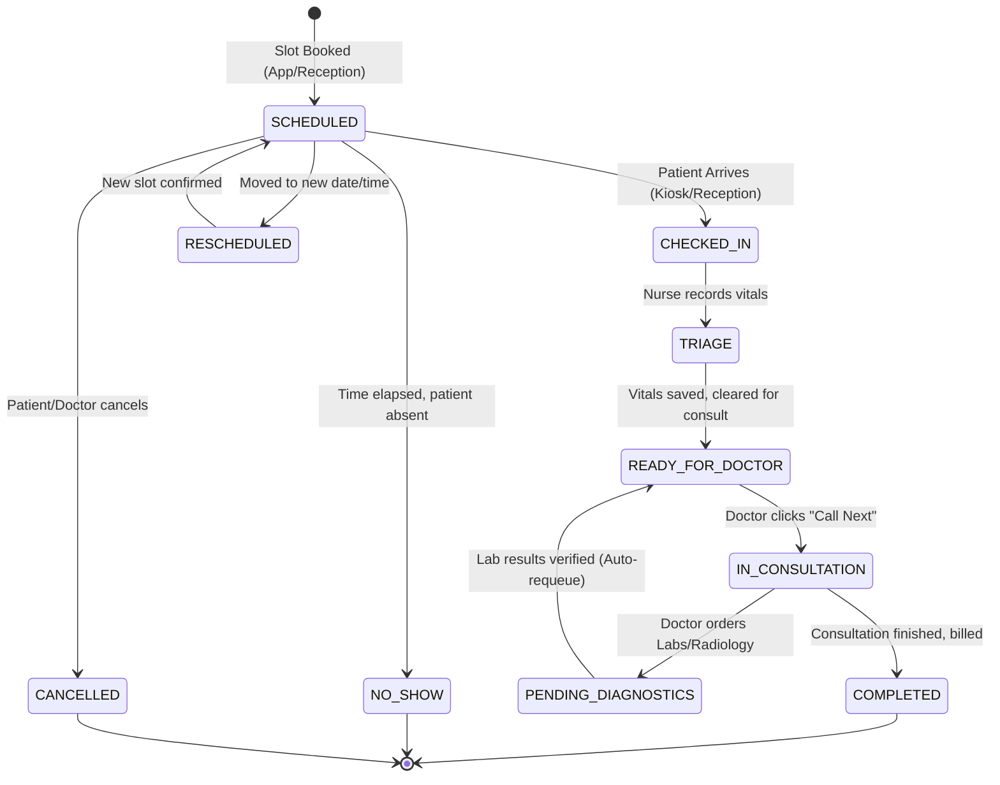

# Appointment & Queue Management

In a **Hospital Management System (HMS)**, the Appointment & Queue Management module is the "air traffic control" of the hospital. It bridges the gap between patient expectations, doctor availability, and operational efficiency.

Poor queue management leads to crowded waiting rooms, frustrated patients, and burned-out doctors. A smart queue engine maximizes doctor utilization while minimizing patient wait times.

Here is the comprehensive **End-to-End Appointment & Queue Management Workflow**.

---

### 🗺️ The Appointment & Queue Flow

---

### 📋 Step-by-Step Workflow Breakdown

#### Phase 1: Slot Configuration & Publishing (The Setup)

*Hospitals need flexibility. Doctors have surgeries, OPD hours, and on-call duties.*

1. **Template Creation:** Doctors or Clinic Managers define recurring templates (e.g., "Dr. Smith: Mon-Wed-Fri, 09:00 - 13:00, 15 mins per slot").
2. **Blockouts & Leaves:** The system automatically blocks slots if the doctor has approved leave, scheduled surgeries, or hospital meetings.
3. **Channel Publishing:** Slots are instantly published to the Patient Mobile App, Web Portal, and the Receptionist's booking grid.
4. **Smart Overbooking (Optional):** If historical data shows a 20% No-Show rate for Friday afternoons, the system can suggest or auto-approve 1-2 "overbooked" slots to ensure the doctor's time isn't wasted.

#### Phase 2: Booking & Pre-Arrival (Patient Engagement)

1. **Multi-Channel Booking:** Patients book via App, Website, or call center. Walk-ins are registered directly by the Receptionist.
2. **Symptom Capture (Pre-Triage):** During booking, the patient selects their primary complaint (e.g., "Chest Pain", "Routine Checkup"). *Critical: "Chest Pain" can automatically flag the appointment as high-priority.*
3. **Automated Reminders:** The system sends SMS/WhatsApp reminders at **24 hours** and **1 hour** before the appointment, including a direct link to reschedule if they can't make it (reducing No-Shows).

#### Phase 3: Arrival, Check-In & Triage (The Waiting Room)

1. **Frictionless Check-In:** Patient arrives and scans a QR code at a self-service Kiosk, or the Receptionist scans their digital health ID. Status changes from `SCHEDULED` to `CHECKED_IN`.
2. **Dynamic Wait Time Calculation:** The system doesn't just show "Queue Position: 5". It calculates: *(Number of patients ahead × Doctor's historical average consult time) + Buffer*. It tells the patient: *"Estimated wait: 22 minutes."*
3. **Triage Routing:** For clinical visits, the patient is routed to the Nursing Station. The nurse records vitals (BP, Temp, SpO2). Once vitals are entered, the status changes to `READY_FOR_DOCTOR`, and the patient moves to the digital doctor queue.

#### Phase 4: The Live Queue Engine (Doctor's Command Center)

*This is where the HMS proves its operational ROI.*

1. **The Doctor's Dashboard:** The doctor sees a real-time Kanban/List view:
    - **Waiting:** 4 patients (Vitals recorded, ready to see).
    - **In-Consultation:** 1 patient (Currently in the cabin).
    - **Pending Labs:** 2 patients (Sent for tests, will return to queue later).
2. **Queue Actions:**
    - **Call Next:** Moves the top patient to `IN_CONSULTATION` and triggers an SMS/Display screen update.
    - **Pause Queue:** Doctor takes a break or handles an emergency; system pauses SMS updates to waiting patients.
    - **Priority Insert:** Doctor or Receptionist can drag-and-drop a VIP or Emergency patient to the top of the queue.
3. **Return from Lab:** If a patient was sent for an X-Ray, the system automatically bumps them back to the *top* of the queue when the Lab marks the result as `VERIFIED`.

#### Phase 5: Exception Handling (The Real World)

- **No-Shows:** If a patient doesn't check in within 30 mins of their slot, the system auto-marks them as `NO_SHOW` and opens the slot for a Walk-in.
- **Walk-Ins:** Receptionist can inject a walk-in patient into the live queue. The system intelligently slots them in based on estimated time, notifying the doctor.
- **Rescheduling:** If a doctor is running 45 minutes late, the system detects the bottleneck and offers the next 3 patients the option to reschedule via SMS with a single click.

---

### 🔄 Appointment & Queue State Machine

---

### 💡 Key Automations to Pitch to the Hospital COO / Medical Director

When demonstrating the Queue Module, emphasize these **"Invisible" Operational Enhancements**:

1. **The "Return-from-Lab" Auto-Bump:**
    - *Pitch:* "In legacy systems, patients finish their blood test and have to go back to the reception to get back in line. In our HMS, the moment the Lab verifies the result, the system automatically bumps the patient back to the *top* of the doctor's waiting queue. Zero friction, zero confusion."
2. **Dynamic Wait-Time Transparency:**
    - *Pitch:* "Patients don't mind waiting as much as they mind *not knowing* how long they'll wait. Our engine uses the doctor's real-time pace to send accurate SMS updates: *'You are 3rd in line, approx 15 mins.'* This reduces lobby anxiety and front-desk complaints by 80%."
3. **Smart Walk-In Balancing:**
    - *Pitch:* "Hospitals can't turn away emergencies or walk-ins, but they ruin scheduled queues. Our system allows admins to reserve 'Buffer Slots' (e.g., 3 slots per hour kept empty for walk-ins). If no walk-ins arrive, the system automatically releases them to the online portal 2 hours before."
4. **No-Show Recovery Loop:**
    - *Pitch:* "When a patient is marked as No-Show, the system instantly triggers an automated, empathetic SMS asking if they need to reschedule, providing a direct link to the booking portal. It turns a missed revenue opportunity into an automated re-engagement workflow."

Would you like to explore the **Database Schema (Tables)** for Appointments, Slots, and Queue Management, or shall we move on to the **Laboratory & Diagnostics Workflow**?