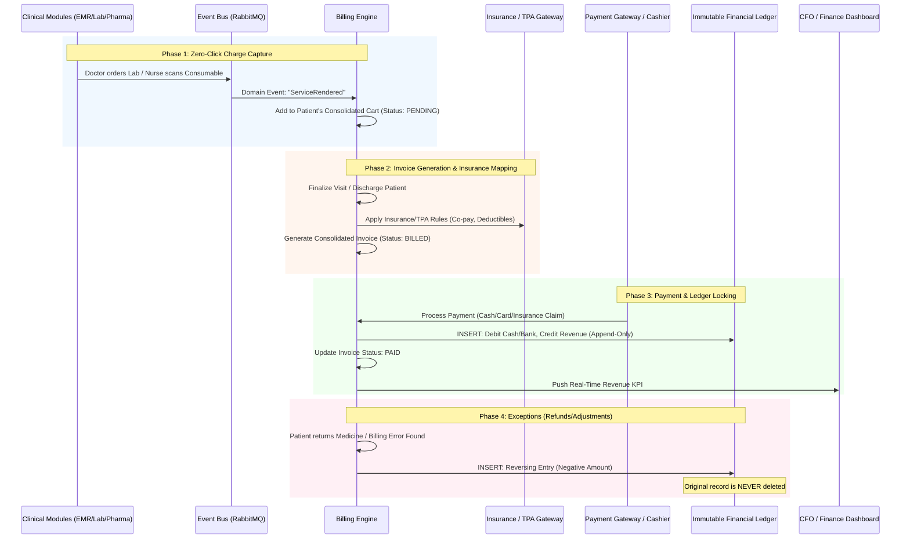
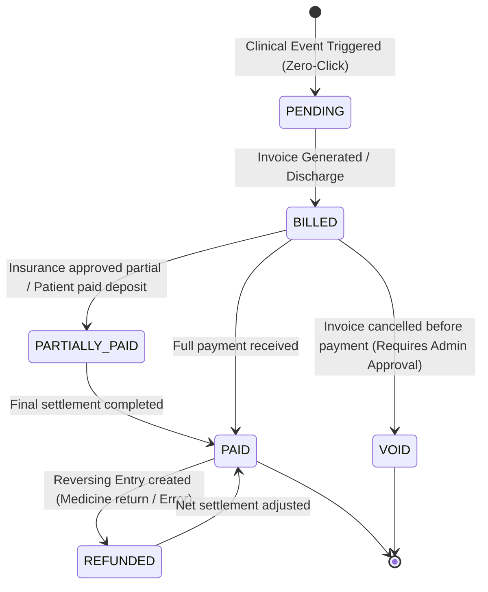

# Billing & Financials

In a **Hospital Management System (HMS)**, the Billing & Financials module is where clinical operations meet financial reality. In legacy systems, billing is an *afterthought*—a manual data entry step at the end of a visit, leading to massive **revenue leakage** (unbilled consumables, missed lab charges) and **audit nightmares** (editable invoices, untracked refunds).

By applying the **Event-Driven Architecture** and **Immutable Ledger** principles from our core supply chain engine, the OmniCare HMS transforms billing from a manual bottleneck into an **automated, tamper-proof financial pipeline**. Every clinical action instantly becomes a financial line item, and every financial adjustment is permanently auditable.

Here is the comprehensive **End-to-End Billing & Financials Workflow**.

---

### 🗺️ The Event-Driven Billing & Ledger Flow

---

### 📋 Step-by-Step Workflow Breakdown

#### Phase 1: The "Zero-Click" Charge Capture (The Revenue Shield)

*Eliminating the gap between clinical care and financial capture.*

1. **Event-Driven Triggers:** The Billing Engine does not rely on humans to "enter a bill." It listens to the hospital's event bus (RabbitMQ).
    - *Doctor finalizes EMR* ➔ Triggers `ConsultationFee` event.
    - *Pharmacist scans medicine barcode* ➔ Triggers `PharmacyDispense` event.
    - *Nurse scans IV fluid barcode at bedside* ➔ Triggers `ConsumableUsed` event.
2. **The Consolidated Patient Cart:** Every event instantly drops a line item into the patient’s virtual "Cart" with the status `PENDING`.
3. **IPD Midnight Auto-Billing:** For admitted patients, a nightly cron job automatically calculates and adds Room Rent, Nursing Charges, and Dietary charges to the running bill based on the Bed Management state machine.

#### Phase 2: Invoice Generation & Insurance/TPA Mapping

*Handling the complexity of healthcare financing.*

1. **Consolidated Invoicing:** When the patient is ready to pay (end of OPD visit or IPD Discharge), the system aggregates all `PENDING` items into a single **Master Invoice**.
2. **Automated Policy Engine:**
    - The system applies pre-configured rules: Package discounts, corporate tie-up rates, or senior citizen concessions.
    - **Insurance/TPA Integration:** The system splits the bill into `Patient Payable` (Co-pay/Deductibles) and `Insurance Payable`. It generates a standardized claim form (or sends an HL7/FHIR payload) to the Third Party Administrator (TPA).
3. **Finalization:** The invoice status changes to `BILLED`. The `PENDING` cart items are locked to this Invoice ID.

#### Phase 3: Payment Processing & The Immutable Ledger ⭐

*Where financial integrity is guaranteed.*

1. **Multi-Modal Payment:** The cashier processes the payment via Cash, Card, UPI, or records an Insurance ECG (Electronic Claim Gateway) approval.
2. **The Immutable Ledger Entry:** The moment payment is confirmed, the system writes to the **Financial Ledger**.
    - *Rule:* **INSERT-ONLY.**
    - *Entry:* `[Timestamp] | Debit: Cash/Bank | Credit: Patient Revenue | Ref: Invoice #123`.
3. **Receipt Generation:** A cryptographically signed digital receipt is generated and emailed/SMS'd to the patient. The invoice status changes to `PAID`.

#### Phase 4: Exception Handling (Refunds, Cancellations & Adjustments)

*How the system handles mistakes without breaking audit compliance.*

1. **The "No-Delete" Rule:** If a cashier makes a mistake, or a patient returns an unopened medicine, **the original invoice or ledger entry CANNOT be deleted or edited.**
2. **Reversing Entries (Credit Notes):**
    - The user initiates a "Refund/Adjustment".
    - The system generates a **Reversing Ledger Entry**: `[Timestamp] | Debit: Refund Liability | Credit: Cash/Bank | Ref: Original Invoice #123`.
    - The original transaction remains in the ledger forever, but the *net financial position* is corrected.
3. **Audit Trail:** The system logs *who* authorized the refund, *why* (reason code: e.g., "Medicine Returned", "Tariff Error"), and links it to the original transaction. Auditors love this.

#### Phase 5: Day-End Reconciliation & CFO Dashboards

*Providing absolute financial visibility to hospital leadership.*

1. **Automated Day-End Closure:** At midnight, the system runs a reconciliation script:
    - *Formula:* `(Cash + Card + Insurance Approved)` MUST EQUAL `(Sum of all Ledger Credits for the day)`.
    - If there is a variance of even $0.01, the system flags it for the Finance Manager.
2. **CFO Dashboard:** Real-time visibility into:
    - **Daily Revenue:** Broken down by Department (OPD, IPD, Pharmacy, Lab).
    - **Accounts Receivable (AR):** Aging reports for Insurance/TPA claims (e.g., "Claims pending > 30 days").
    - **Revenue Leakage Metrics:** Value of services rendered but not yet billed (if any system errors occur).

---

### 🔄 Invoice & Payment State Machine

---

### 💡 Key Automations to Pitch to the Hospital CFO & CEO

When demonstrating the Financial Module to the hospital's financial leadership, emphasize these **ROI and Compliance drivers**:

1. **The "Ghost Charge" Eradicator (Zero Revenue Leakage):**
    - *Pitch:* "In legacy systems, nurses administer expensive cardiac stents or IV drugs and manually write them on a paper sheet at the end of the shift. 5% to 10% is lost to fatigue or forgetfulness. In OmniCare, the barcode scan at the bedside *is* the billing event. You capture 100% of the revenue for every consumable used, automatically."
2. **The Immutable Audit Shield (Fraud Prevention):**
    - *Pitch:* "Internal financial fraud often happens by quietly deleting or altering past invoices. Our Financial Ledger is append-only. If a refund is issued, it creates a mathematical reversing entry, leaving the original record intact. When your external auditors arrive, you hand them a system that is mathematically incapable of hiding deleted transactions. It is tamper-evident by design."
3. **Automated TPA/Insurance Mapping:**
    - *Pitch:* "Calculating co-pays, deductibles, and policy exclusions manually leads to claim rejections and delayed cash flow. Our billing engine maps clinical ICD-10 codes and item tariffs directly to Insurance policies at the point of invoice generation, reducing claim rejection rates and accelerating cash realization."
4. **The Midnight IPD Auto-Biller:**
    - *Pitch:* "Your ward nurses spend up to 2 hours per shift manually calculating room charges and dietary bills. Our system integrates with the Bed Management state machine. If a patient occupies Bed 302 for 14 hours, the system automatically bills the 14 hours at midnight. Nurses go back to nursing; the hospital gets paid accurately."

---

### 💻 Database Schema Sneak Peek (Financials)

To support this, the financial schema relies on strict double-entry principles and event sourcing:

- `invoices` (invoice_id, patient_id, encounter_id, total_amount, discount, insurance_amount, patient_payable, status, created_at)
- `invoice_items` (item_id, invoice_id, source_event_type [PHARMACY, LAB, ROOM], source_event_id, amount, is_reversed)
- `payments` (payment_id, invoice_id, method, amount, transaction_ref, status)
- `financial_ledger` (ledger_id, timestamp, account_code, debit, credit, reference_type, reference_id, created_by) -> **The Immutable Core**
- `refund_requests` (refund_id, invoice_id, amount, reason_code, approved_by, status)

Would you like to explore the **Ward, Bed & Inpatient Management Workflow** (which feeds the midnight auto-billing), or shall we dive into the **Database Schema (ERD)** for the entire HMS ecosystem?