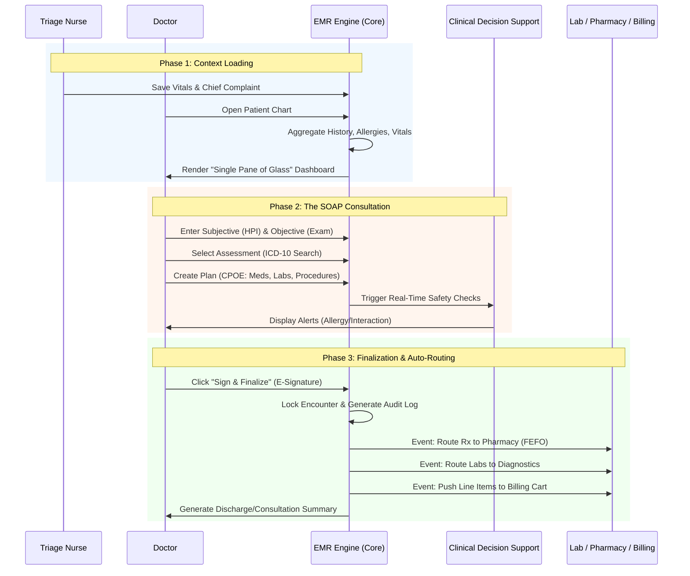
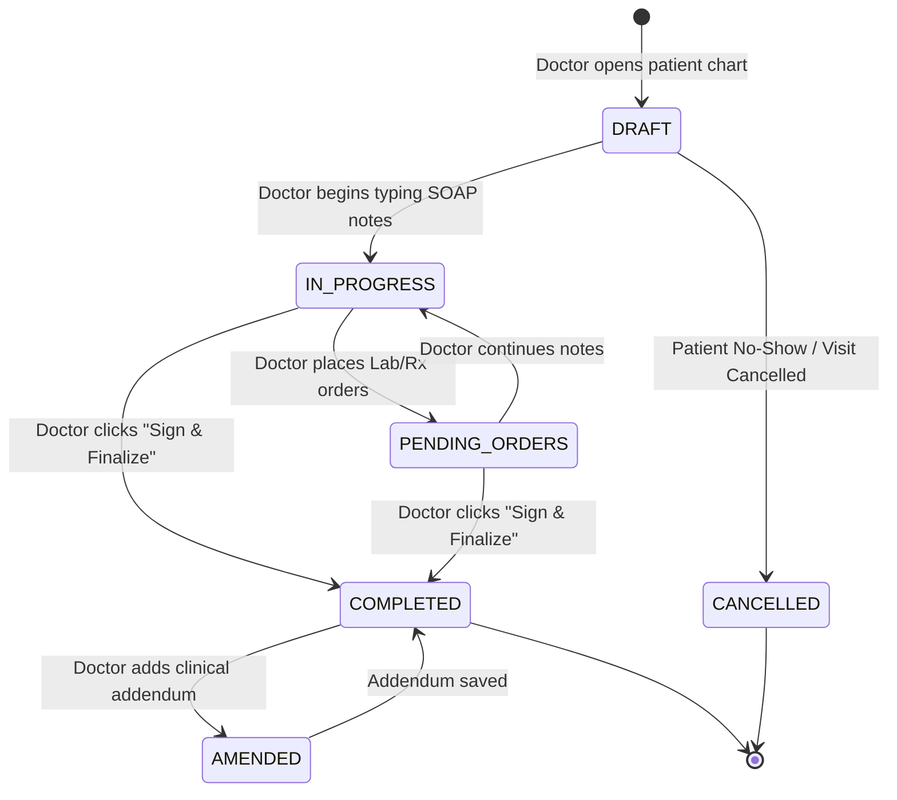

# Consultation & EMR (Electronic Medical Records)

In a modern **Hospital Management System (HMS)**, the Consultation & Electronic Medical Record (EMR) module is the clinical heartbeat of the platform. For doctors, a clunky EMR means burnout; for the hospital, a poorly integrated EMR means missed charges and medical errors.

The **OmniCare EMR** is designed around the industry-standard **SOAP** (Subjective, Objective, Assessment, Plan) framework, optimized for a **"3-Click Consultation"** experience, and powered by an event-driven architecture to ensure zero revenue leakage.

Here is the comprehensive **End-to-End Consultation & EMR Workflow**.

---

### 🗺️ The Clinical Encounter & EMR Flow

---

### 📋 Step-by-Step Workflow Breakdown

#### Phase 1: Context Loading (The "Warm-Up")

*Doctors shouldn't have to hunt for information. The system brings the data to them.*

1. **Triage Handoff:** The nurse finishes triage, entering vitals (BP, HR, Temp, SpO2) and the primary complaint. This instantly unlocks the patient's chart for the doctor.
2. **Chart Aggregation:** When the doctor opens the EMR, the system asynchronously loads:
    - **Red Flags:** Active allergies and chronic conditions pinned to the top.
    - **Timeline:** A chronological view of past visits, surgeries, and recent lab results.
    - **Current Vitals:** Auto-populated from the triage nurse's entry.
3. **Smart Templates:** Based on the patient's chronic conditions (e.g., Diabetes) or the doctor's specialty, the system pre-loads relevant EMR templates to save typing.

#### Phase 2: The Clinical Encounter (The SOAP Note)

*The core workspace is divided into intuitive sections following the SOAP methodology.*

1. **Subjective:** Doctor documents the History of Present Illness (HPI), review of systems, and patient's own description of symptoms. Voice-to-text integration can be used here.
2. **Objective:** Doctor records physical examination findings. (Vitals are already locked in from Phase 1).
3. **Assessment (Diagnosis):** Doctor uses a **Smart ICD-10 Search**. Typing "Type 2 diab" instantly suggests `E11.9 - Type 2 diabetes mellitus without complications`. Multiple diagnoses can be ranked (Primary, Secondary).
4. **Plan (CPOE - Computerized Physician Order Entry):**
    - **Medications:** Search drug, set dose, route, frequency, and duration.
    - **Investigations:** Order Labs (e.g., HbA1c, Lipid Panel) or Radiology (e.g., X-Ray Chest).
    - **Procedures/Referrals:** Schedule an in-house procedure or refer to another specialist.

#### Phase 3: Clinical Decision Support (CDSS) & Safety Checks

*Before the doctor can finalize, the system acts as a digital safety net.*

1. **Real-Time Intercepts:** As the doctor types a prescription or orders a test, the CDSS engine runs in the background:
    - **Allergy Check:** "Patient is allergic to Penicillin. Amoxicillin is contraindicated." *(Hard Stop)*
    - **Drug-Drug Interaction:** "Patient is on Warfarin. Prescribing Aspirin increases bleeding risk." *(Soft Stop / Override with reason required)*
    - **Duplicate Therapy:** "Patient already has an active prescription for Metformin."
    - **Dosage Guard:** "Prescribed dose exceeds maximum daily limit for patient's age/weight."
2. **Lab Appropriateness:** Flags if the ordered lab test conflicts with the patient's diagnosis or recent results.

#### Phase 4: Finalization & Event-Driven Auto-Routing (The "Magic")

*This is where the HMS proves its operational ROI. The doctor never "bills" the patient or "calls" the pharmacy.*

1. **E-Signature:** The doctor clicks **"Sign & Finalize"**. They authenticate via PIN or biometric. The encounter is cryptographically locked.
2. **Event-Driven Orchestration:** The EMR publishes domain events to the hospital's message bus (RabbitMQ):
    - `PrescriptionCreated` ➔ Routes to Pharmacy Queue (triggering FEFO batch allocation).
    - `LabOrderCreated` ➔ Routes to Lab Queue (generating barcode labels).
    - `EncounterFinalized` ➔ Pushes Consultation Fee + Procedure Fees to the Patient's Billing Cart.
3. **Document Generation:** The system auto-generates a formatted Consultation Summary / Prescription sheet, ready to be printed at the reception or emailed to the patient.

#### Phase 5: The Longitudinal EMR & Audit Vault

1. **Immutable Record:** The SOAP note, diagnosis, and orders are saved as an immutable record.
2. **Amendments:** If a doctor realizes a mistake later, they *cannot* delete the original note. They must create an **Addendum/Amendment**, which is appended to the record with a timestamp and reason. This ensures 100% legal and regulatory compliance.
3. **Continuous Timeline:** The data from this consultation instantly becomes part of the patient's permanent, searchable longitudinal medical record for future visits.

---

### 🔄 Consultation State Machine

---

### 💡 Key Automations to Pitch to the Medical Director & CEO

When demonstrating the EMR module to hospital leadership, emphasize these **invisible automations** that drive clinical safety and financial health:

1. **The "Zero-Click" Billing Capture:**
    - *Pitch:* "Doctors hate billing, and hospitals lose up to 5% of revenue to missed charges. In our EMR, the doctor never sees a billing screen. The moment they order an MRI or prescribe a consumable, the event-driven architecture creates a pending financial line item. Revenue leakage drops to zero, and doctors stay focused on the patient."
2. **The CDSS Safety Net:**
    - *Pitch:* "Human error is inevitable; system error shouldn't be. Our embedded Clinical Decision Support acts as a tireless pharmacist and senior consultant, catching lethal drug interactions and allergy mismatches *before* the prescription is signed. This directly reduces malpractice liability."
3. **Context-Aware Smart Templates:**
    - *Pitch:* "We know doctors hate data entry. If a patient comes in for a diabetic follow-up, the EMR automatically loads the diabetic template, pre-fills the chronic meds, and just asks the doctor to update the HbA1c and current symptoms. We cut documentation time by 40%."
4. **The "One-Click" Handover:**
    - *Pitch:* "When the doctor signs the note, the work isn't done—the routing is. The system instantly alerts the lab to draw blood, the pharmacy to pull the drugs (using FEFO to save money), and the cashier to print the bill. The patient experiences a seamless, coordinated care journey."

Would you like to explore the **Database Schema (ERD)** specifically designed for the EMR (Tables for `encounters`, `soap_notes`, `icd_codes`, `cdss_alerts`), or shall we move on to the **Laboratory & Diagnostics Workflow**?