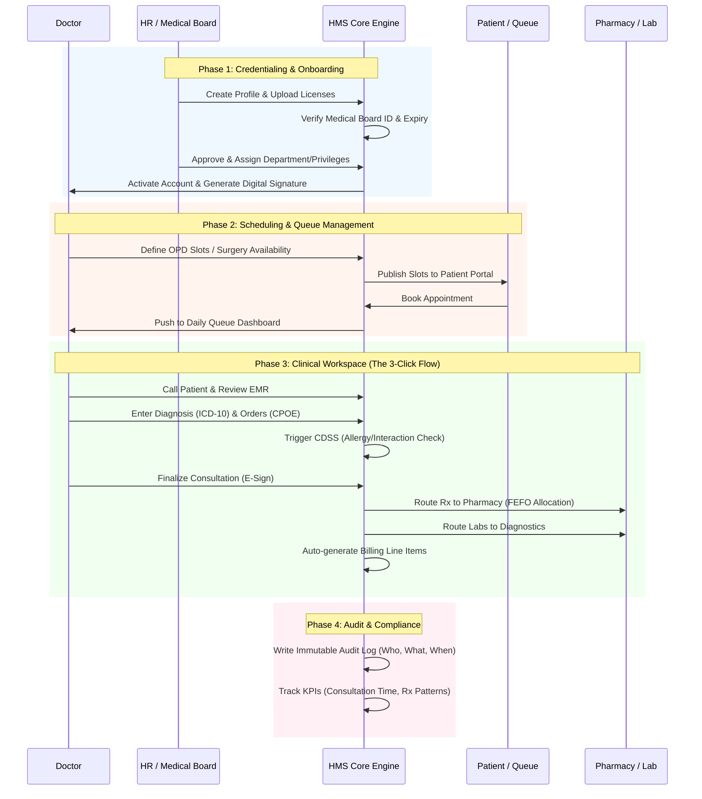
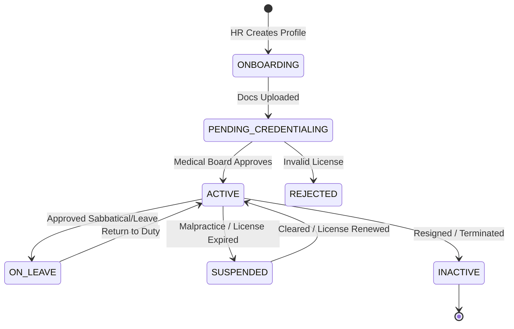

# Doctor Management

In a **Hospital Management System (HMS)**, Doctor Management is the most critical clinical workflow. It bridges **HR compliance (credentialing)**, **operational efficiency (scheduling)**, and **clinical safety (EMR & Prescribing)**.

Drawing on the robust architectural principles of the system (such as immutable audit logs, event-driven routing, and strict RBAC), here is the comprehensive **End-to-End Doctor Management Workflow**.

---

### 🗺️ The Doctor Lifecycle & Clinical Flow

---

### 📋 Step-by-Step Workflow Breakdown

#### Phase 1: Credentialing & Privileging (The Gatekeeper)

*Hospitals face massive liability if an unverified or expired-license doctor treats patients. This phase automates compliance.*

1. **Application & Document Upload:** HR or Department Head creates the doctor's profile. The doctor uploads their Medical Degree, Board Registration Certificate, and Malpractice Insurance.
2. **System Verification:** The system validates the Medical License Number against external registries (if integrated) or flags it for Medical Board review.
3. **Privilege Mapping:** The Admin assigns **Clinical Privileges** (e.g., Dr. Smith is allowed to prescribe *Narcotics* and perform *Endoscopies*, but not *Open Heart Surgery*).
4. **Activation & E-Signature:** Once approved, the account becomes `ACTIVE`. The doctor captures their digital signature on a tablet, which is cryptographically bound to their JWT profile for all future e-prescriptions.
- **System Automation:** If a license expires in 30 days, the system sends automated warnings. **On the exact day of expiry, the system automatically revokes the doctor's ability to prescribe or consult** until renewed, protecting the hospital from malpractice suits.

#### Phase 2: Scheduling & Queue Management (The Operational Core)

*Maximizing doctor utilization while preventing patient overcrowding.*

1. **Template Creation:** Doctors or Clinic Managers define recurring availability templates (e.g., "Mon/Wed/Fri: 09:00 - 13:00, 30 min per slot").
2. **Slot Publishing:** The system generates bookable slots for the Patient Portal and Reception.
3. **Live Queue Dashboard:** On the day of the OPD, the doctor logs into their dashboard. They see a real-time queue:
    - `Checked-In` (Waiting in lobby)
    - `In-Consultation` (Currently in the cabin)
    - `Pending Labs` (Sent for tests, will return)
4. **Ad-Hoc Management:** If a doctor is running late or called to an emergency surgery, they can trigger a "Delay Alert". The system automatically sends SMS/WhatsApp updates to the next 5 patients in the queue, reducing lobby frustration.

#### Phase 3: The Clinical Workspace (The Doctor's Domain)

*This is where the HMS proves its ROI by reducing doctor burnout. The goal is a **3-Click Consultation**.*

1. **Patient Intake:** Doctor clicks "Call Next". The patient's EMR opens, showing a unified timeline: past visits, allergies, chronic conditions, and today's vitals (entered by the triage nurse).
2. **CPOE (Computerized Physician Order Entry):**
    - **Diagnosis:** Doctor selects ICD-10 codes via smart-search.
    - **Prescriptions:** Doctor types "Amox" -> System suggests *Amoxicillin 500mg*. Doctor sets dosage (1-0-1 for 5 days).
    - **Labs/Radiology:** Doctor orders a CBC and X-Ray.
3. **CDSS (Clinical Decision Support System) Trigger:** *Before* finalizing, the system runs a background check. If the patient is allergic to Penicillin, or if the new drug interacts with their current cardiac medication, a **Red Hard-Stop Alert** appears.
4. **Finalize & E-Sign:** Doctor clicks "Complete & Sign".
    - *Event-Driven Magic:* The prescription is instantly routed to the Pharmacy Queue (triggering the FEFO inventory allocation). The lab order hits the LIS. The consultation fee and procedure fees are atomically added to the patient's billing cart.

#### Phase 4: Audit, Compliance & Peer Review (The Safety Net)

*Leveraging the system's Immutable Ledger and Audit capabilities.*

1. **Immutable Audit Trail:** Every action the doctor takes (viewing a record, altering a prescription, cancelling an order) is written to an append-only audit log. *Even database admins cannot alter this log.*
2. **Controlled Substance Tracking:** If the doctor prescribes an opioid or psychotropic drug, the system generates a secondary regulatory report automatically, logging the exact patient ID, dosage, and doctor's digital signature for government narcotics bureaus.
3. **Prescription Analytics:** The Analytics Service tracks the doctor's prescribing patterns (e.g., "Dr. A prescribes 30% more high-end antibiotics than the department average"). This data is available to the Medical Director for peer review and cost-control.

#### Phase 5: Offboarding & Access Revocation (Security First)

*When a doctor leaves the hospital or is suspended.*

1. **Immediate Revocation:** HR changes status to `INACTIVE` or `SUSPENDED`.
2. **System Action:**
    - All active JWT sessions are instantly invalidated (forced logout).
    - The doctor is removed from all future OPD/Surgery rosters.
    - Active inpatient cases are reassigned to the Department Head.
3. **Historical Preservation:** The doctor's name remains on all past prescriptions and medical records (for legal and continuity-of-care reasons), but their profile is locked, and their digital signature is marked as `REVOKED`.

---

### 🔄 Doctor Account & Status State Machine

---

### 💡 Key Automations to Pitch to the Medical Director / CEO

When demonstrating the Doctor Management Module to hospital leadership, emphasize these **invisible automations**:

1. **The "License-Expiry Kill-Switch":**
    - *Pitch:* "You never have to worry about a doctor practicing on an expired license again. The system integrates credentialing with the login gateway. If the medical board license expires at midnight, the doctor's EMR access and e-prescription rights are cryptographically blocked at 00:01. Zero liability."
2. **Zero-Click Billing Capture:**
    - *Pitch:* "Doctors hate billing, and hospitals hate missed charges. In our system, the doctor never 'bills' a patient. The moment they order an MRI or prescribe a bandage, the event-driven architecture creates a pending financial line item. Revenue leakage drops to 0%."
3. **Smart Handover & Continuity of Care:**
    - *Pitch:* "If a doctor is unavailable, the system doesn't just show a blank screen. It automatically routes their urgent lab results and inpatient alerts to the designated 'Covering Physician' for that shift, ensuring patient safety is never compromised by a scheduling gap."
4. **Tamper-Proof E-Prescriptions:**
    - *Pitch:* "Because we use an append-only ledger architecture, once a doctor signs a prescription, it cannot be silently altered or deleted by anyone—not even a system admin. If a change is needed, a formal amendment trail is created. This guarantees 100% audit readiness for health inspectors."

Would you like to explore the **Database Schema (ERD)** for the Doctor/Patient/EMR relationship, or move on to the **Pharmacy & Inventory Workflow** within the hospital?