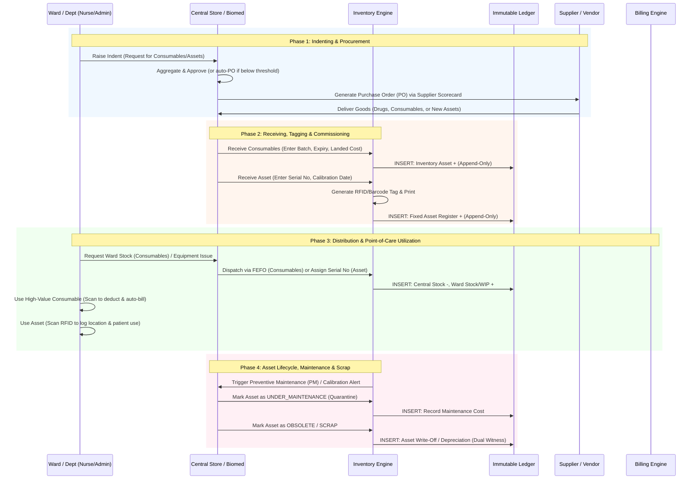
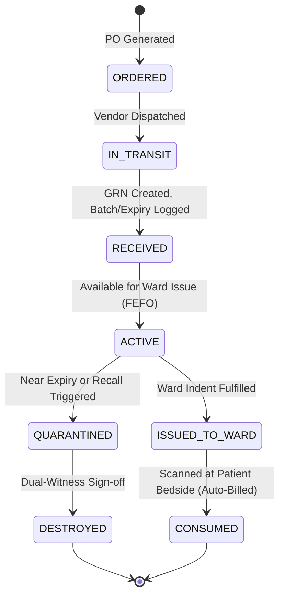
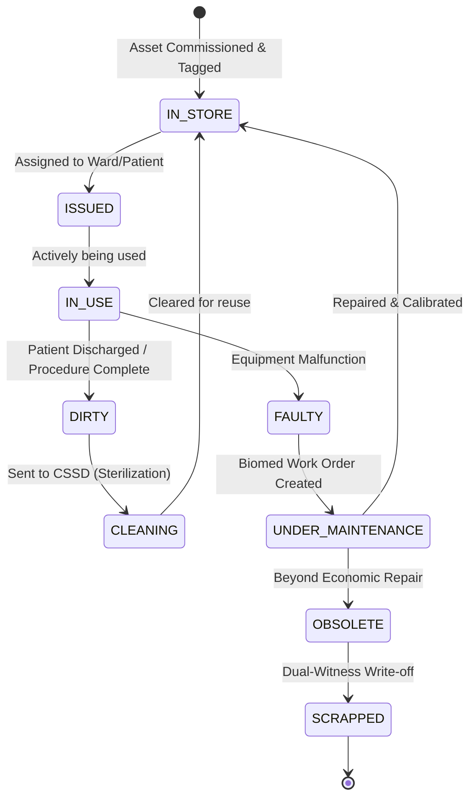

# Inventory & Supply Chain

# 🏥 OmniCare HMS — Comprehensive Hospital Inventory & Supply Chain Workflow

In a modern **Hospital Management System (HMS)**, "Inventory" is not just about medicines. A hospital is a massive, complex consumer of diverse materials: **daily consumables** (syringes, gloves), **high-value consumables** (cardiac stents, orthopedic implants), **reusable medical equipment** (infusion pumps, defibrillators), and **infrastructure** (beds, wheelchairs, rooms).

Managing this requires a multi-tiered supply chain engine. By applying the enterprise-grade principles from our core architecture—**FEFO Allocation, Batch/Serial Tracking, Immutable Ledger, Unified Transactions, and Instant Quarantine**—the OmniCare HMS Inventory module transforms hospital logistics from a chaotic cost center into a precision-controlled, audit-proof operation.

---

## 🗺️ The Multi-Category Item Matrix

Before defining the workflow, the system categorizes items, as their lifecycle rules differ drastically:

| Category | Examples | Tracking Method | Key Engine / Rule |
| --- | --- | --- | --- |
| **Pharmaceuticals** | Medicines, Vaccines, IV Fluids | Batch No. + Expiry Date | **FEFO** (First-Expired, First-Out), Cold Chain alerts. |
| **General Consumables** | Syringes, Gloves, Reagents, Masks | Batch No. + Expiry Date | **FEFO**, Min/Max Reorder Alerts, Bulk Issue. |
| **High-Value Consumables** | Stents, Implants, Pacemakers | Serial No. / UDI (Unique Device ID) | **Patient-Linked Billing**, Strict Traceability. |
| **Reusable Equipment** | Infusion Pumps, Ventilators, Monitors | Serial No. / RFID Tag | **Calibration/PM Tracking**, Sterilization State, Location. |
| **Infrastructure / Assets** | Hospital Beds, Wheelchairs, OT Tables | Asset Tag / Barcode | **Depreciation**, Maintenance, Room Assignment. |

---

## 🔄 The End-to-End Hospital Inventory Flow

---

## 📋 Step-by-Step Workflow Breakdown

### Phase 1: Indenting & Procurement (The Demand Signal)

*Hospitals operate on a "Pull" system driven by clinical wards, not top-down guessing.*

1. **Ward Indent (Request):** The Ward Sister or Department Head raises an internal requisition for the upcoming week (e.g., 500 IV sets, 2 new Wheelchairs).
2. **Central Store Aggregation:** The Central Store Manager reviews all ward indents. The system checks current Central Stock.
3. **Auto-PO Generation:** If `Central Stock + Ward Stock < Reorder Level`, the system automatically drafts a **Purchase Order (PO)** to the pre-qualified vendor, prioritizing vendors with the highest **Supplier Scorecard** ratings (on-time delivery, fulfillment accuracy).
4. **Approval Routing:** High-value asset POs (e.g., a new MRI machine or 50 Hospital Beds) automatically escalate to the Hospital CFO / Medical Director for approval based on configured value thresholds.

### Phase 2: Receiving, Tagging & Commissioning (The Gate)

*How items enter the hospital's financial and operational control.*

1. **Consumables & Drugs (Batch Tracking):**
    - Storekeeper receives the goods and enters **Batch Number, Expiry Date, Quantity, and Purchase Price**.
    - The system enforces **FEFO** rules for future ward issues.
    - *Ledger Action:* Inventory Value increases; Accounts Payable is credited (Append-Only).
2. **Reusable Assets & Equipment (Serial Tracking):**
    - Biomedical Engineering or Storekeeper receives the asset (e.g., Ventilator).
    - Enters **Serial Number, Manufacturer, Warranty Expiry, and Initial Calibration Date**.
    - The system generates a unique **Barcode / RFID tag** to be physically attached to the device.
    - *Ledger Action:* Fixed Asset Register increases; Depreciation schedule begins.
3. **Infrastructure (Beds/Rooms):** New beds are entered into the **Facility Registry**, assigned to a specific Ward/Room, and marked as `READY_FOR_PATIENT`.

### Phase 3: Distribution & Point-of-Care Utilization (The Flow)

*Moving items from Central Store to the patient's bedside, with zero revenue leakage.*

1. **Consumable Replenishment (FEFO):**
    - Central store fulfills the Ward Indent. The system automatically selects the batch expiring soonest (**FEFO Allocation Preview**).
    - *Ledger Action:* Central Stock decreases; Ward Stock (Consumable) increases.
2. **Equipment Issuance (Serial Tracking):**
    - A patient is admitted and requires an Infusion Pump. The Nurse requests it.
    - Central Store issues a specific pump (e.g., `Serial# IP-992`). The system now tracks that `IP-992` is located in `Ward 3 - Room 302`.
3. **Point-of-Care Consumption (Zero-Click Billing ⭐):**
    - When a nurse administers a high-value consumable (e.g., a specialized cardiac stent), they scan the item's **UDI/Barcode** against the patient's wristband.
    - *System Action:* Inventory is instantly deducted, and the cost is atomically pushed to the patient's billing invoice. No manual data entry at the end of the shift.

### Phase 4: Asset Lifecycle, Maintenance & State Management

*Unlike consumables, reusable assets require continuous operational tracking.*

1. **Biomedical Engineering (Biomed) Integration:**
    - The system tracks **Preventive Maintenance (PM)** and **Calibration** schedules based on manufacturer guidelines or regulatory laws.
    - 15 days before a Ventilator's calibration is due, the system alerts the Biomed team.
2. **Equipment State Machine:**
    - Reusable items move through strict states: `IN_STORE` ➔ `ISSUED_TO_WARD` ➔ `IN_USE` ➔ `DIRTY (Needs Sterilization)` ➔ `CLEAN` ➔ `FAULTY (Sent to Biomed)`.
    - *Infection Control:* If an item is marked `DIRTY` or `FAULTY`, the system physically prevents it from being issued to another patient.
3. **Bed & Room State Machine (Infrastructure as Inventory):**
    - Beds are treated as dynamic inventory. States: `AVAILABLE` ➔ `OCCUPIED` ➔ `DISCHARGE_PENDING` ➔ `CLEANING (Housekeeping)` ➔ `MAINTENANCE` ➔ `AVAILABLE`.
    - *Automation:* When a patient is discharged, the bed status auto-flips to `DISCHARGE_PENDING`, triggering a push notification to the Housekeeping staff's mobile app to clean it.

### Phase 5: Expiry, Scrap & Bio-Medical Waste (The End of Life)

*Handling the safe, compliant, and financially accurate disposal of hospital materials.*

1. **Consumable/Drug Expiry:**
    - Items nearing expiry trigger alerts. If they expire, they are moved to the **Quarantine** state.
    - Storekeeper initiates **Destruction**. Requires **Dual-Witness Sign-off** (Store + Pharmacy/Infection Control).
    - *Ledger Action:* Immutable write-off entry. Generates a regulatory Destruction Certificate.
2. **Asset Decommissioning (Scrap):**
    - When an asset (e.g., an old hospital bed or obsolete monitor) is beyond repair, Biomed marks it as `OBSOLETE`.
    - Admin approves the **Scrap/Disposal** workflow.
    - *Ledger Action:* Asset is removed from the Fixed Asset Register; residual scrap value (if sold to a junk dealer) is recorded.
3. **Bio-Medical Waste Tracking:**
    - For hazardous waste, the system logs the weight/category of waste handed over to certified external disposal vendors, ensuring environmental compliance.

---

## 🔄 Inventory State Machines

### Consumable / Batch State Machine

### Reusable Asset State Machine

---

## 🛡️ The "Killer Features" for Hospital Supply Chain

When pitching this module to the **Hospital COO, CFO, and Infection Control Officer**, emphasize these advanced capabilities derived from our core architecture:

#### 1. The "Instant Quarantine" (Infection Control & Safety)

- **Scenario:** The FDA issues a recall on a specific batch of IV fluids due to contamination, or Biomed discovers a fault in a specific batch of defibrillator batteries.
- **The OmniCare Action:** The administrator selects the Batch/Serial range. In **seconds**, the system:
    1. Locks the stock in the Central Store.
    2. Locks the stock in *all* Ward Stores.
    3. Flags any equipment currently `IN_USE` on the nursing dashboards with a **RED "DO NOT USE"** alert.
- **Pitch:** *"We turn a hospital-wide infection risk from a days-long manual phone-tree into a 3-second automated lockdown. Patient safety is guaranteed by the system, not by human memory."*

#### 2. The "Ghost Asset" Eradicator (Financial Integrity)

- **Scenario:** Hospitals notoriously lose track of wheelchairs, monitors, and pumps. They buy new ones while old ones sit unused in a basement.
- **The OmniCare Action:** By combining **RFID/Barcode scanning** with the **Immutable Ledger**, every movement of a high-value asset is recorded. If an asset hasn't been scanned or logged in 90 days, the system flags it as "Dormant" and alerts maintenance to locate it.
- **Pitch:** *"Our supply chain engine doesn't just track what you buy; it tracks where it lives. We typically help hospitals recover 10-15% of 'lost' capital equipment within the first year, paying for the software instantly."*

#### 3. Ward-Level FEFO & Expiry Shield

- **Scenario:** Wards often hoard emergency consumables, which then expire unnoticed in the back of a cupboard.
- **The OmniCare Action:** The system tracks expiry dates *even after* the item is issued to the Ward Store. 30 days before a ward's stock of sterile dressings expires, the system alerts the Ward Sister to use it or return it to Central Store for redistribution to a higher-volume ward.
- **Pitch:** *"We extend the FEFO engine beyond the central pharmacy. We protect your margins at the very edge of care—the patient's bedside."*

#### 4. Predictive Maintenance (IoT Ready)

- **Scenario:** A critical anesthesia machine fails during surgery because a routine calibration was missed.
- **The OmniCare Action:** The system tracks usage hours (if integrated with IoT/machine data) or time-based schedules. It auto-generates a work order for Biomed and blocks the machine's status to `UNDER_MAINTENANCE` in the OT scheduling module so it cannot be booked.
- **Pitch:** *"We shift your biomedical engineering from reactive firefighting to predictive reliability. Zero equipment-related surgical cancellations."*

---

## 💻 Database Schema Sneak Peek (Multi-Category Inventory)

To support this, the database moves beyond simple `medicines` to a unified `items` table with polymorphic relationships, backed by the **Immutable Ledger**:

- `items` (item_id, name, category [DRUG, CONSUMABLE, ASSET, INFRA], uom, reorder_level)
- `item_batches` (batch_id, item_id, batch_no, expiry_date, qty) -> *For Drugs/Consumables*
- `asset_registry` (asset_id, item_id, serial_no, mac_address, purchase_date, warranty_expiry, calibration_due, current_location_id, status) -> *For Reusable Equipment*
- `facilities` (facility_id, type [ROOM, BED, OT], ward_id, status [AVAILABLE, MAINTENANCE, CLEANING]) -> *For Infrastructure*
- `inventory_ledger` (ledger_id, item_id, batch_id OR asset_id, from_location, to_location, qty, transaction_type, timestamp) -> ***The Immutable Core: INSERT-only tracking for ALL categories.***

Would you like to explore the **Biomedical Engineering (Biomed) & Maintenance Workflow** in detail, or shall we move on to the **Housekeeping & Bed Turnover Workflow**?