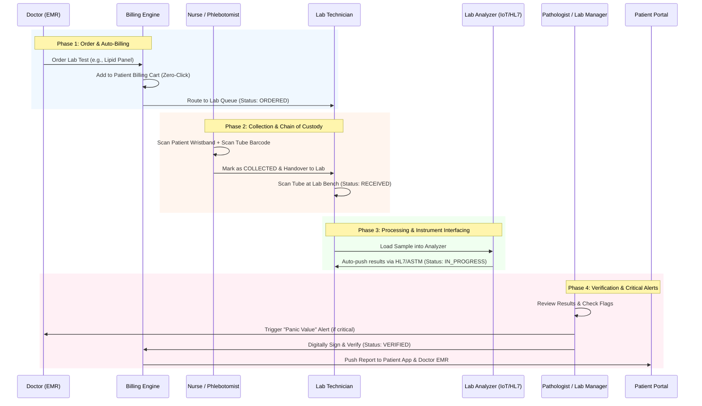
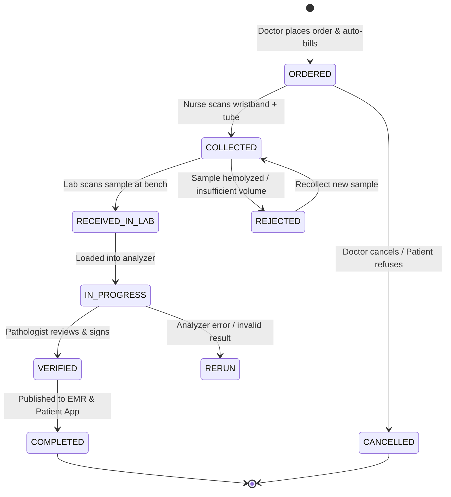

# Laboratory & Diagnostics

In a **Hospital Management System (HMS)**, the Laboratory & Diagnostics module is where clinical decisions are validated. A fragmented lab workflow leads to lost samples, delayed Turnaround Times (TAT), transcription errors, and unbilled tests.

By applying the same **end-to-end traceability, barcode-driven chain of custody, and immutable audit principles** used in top-tier supply chain systems, the OmniCare HMS Laboratory module ensures 100% sample integrity, zero revenue leakage, and rapid clinical decision-making.

Here is the comprehensive **End-to-End Laboratory & Diagnostics Workflow**.

---

### 🗺️ The Laboratory & Diagnostics Flow

---

### 📋 Step-by-Step Workflow Breakdown

#### Phase 1: Order Entry & Auto-Billing (The Trigger)

*Eliminating unbilled tests and manual lab requisition forms.*

1. **CPOE (Order Entry):** The doctor orders a test (e.g., "Complete Blood Count") directly from the EMR. The system checks if the patient has fasting requirements and displays instructions.
2. **Zero-Click Billing:** The moment the order is signed, the cost of the test is atomically added to the patient's consolidated billing cart. *No manual billing entry required.*
3. **Queue Routing:** The order instantly appears in the **Phlebotomy/Lab Queue** with the status `ORDERED`.

#### Phase 2: Sample Collection & Chain of Custody (The Physical Handoff)

*Preventing the #1 cause of lab errors: Wrong-Patient Blood Draws.*

1. **Bedside/Phlebotomy Verification:** The nurse or phlebotomist scans the **Patient’s Wristband Barcode**, then scans the **Vacutainer/Tube Barcode**.
    - *System Action:* If the tube type matches the ordered test (e.g., Purple top for CBC), the system turns **GREEN**. If mismatched, a **Hard-Stop Alarm** sounds.
2. **Status Update:** The sample status changes to `COLLECTED`. The timestamp is locked.
3. **Lab Receipt:** When the sample arrives at the lab, the Lab Technician scans the tube again. Status changes to `RECEIVED_IN_LAB`. The system now tracks the exact **Turnaround Time (TAT)** from the moment of collection.

#### Phase 3: Processing & Instrument Interfacing (The Science)

*Eliminating manual transcription errors.*

1. **Analyzer Integration (HL7/ASTM):** The lab tech loads the sample into the automated hematology or chemistry analyzer.
2. **Auto-Result Capture:** Instead of typing results manually, the analyzer sends the data directly back to the HMS via bi-directional HL7/ASTM interfaces.
3. **Status Update:** The order status moves to `IN_PROGRESS`.

#### Phase 4: Verification & Critical Value Management (The Safety Net)

*Where the system acts as a tireless safety officer.*

1. **Automated Flagging:** The system automatically highlights abnormal results (e.g., red text for high/low values outside the reference range).
2. **Panic Value (Critical Result) Protocol:** If a result is life-threatening (e.g., Potassium > 6.0 mmol/L):
    - The system instantly triggers a **Red Pop-up Alert** on the Doctor’s EMR dashboard.
    - An automated SMS/Push notification is sent to the attending physician.
    - The system logs that the doctor acknowledged the critical value (required for regulatory compliance).
3. **Digital Sign-off:** The Pathologist or Lab Manager reviews the flagged results, adds any interpretive comments, and digitally signs the report. Status changes to `VERIFIED`.

#### Phase 5: Result Delivery & EMR Integration (The Outcome)

1. **Doctor Action:** The verified report instantly pins to the patient’s EMR timeline. The doctor can trend the results against previous visits (e.g., viewing a line graph of HbA1c over 3 years).
2. **Patient Access:** The report is automatically published to the Patient Mobile App/Web Portal. The patient receives an SMS: *"Your lab reports are ready. View them securely in the OmniCare App."*
3. **Immutable Audit:** The entire lifecycle (who ordered, who collected, which analyzer ran it, who verified it) is written to the immutable audit ledger.

---

### 🔄 Lab Order State Machine

---

### 💡 Key Automations to Pitch to the Lab Director & CFO

When demonstrating the Laboratory Module to hospital leadership, emphasize these **operational and clinical ROI drivers**:

1. **The "Panic Value" Auto-Escalation:**
    - *Pitch:* "Human fatigue leads to missed critical lab results. Our system doesn't just flag a critical value; it actively hunts down the doctor. If a Potassium level is critical, the system locks the result, triggers an EMR pop-up, and sends an SMS to the attending physician. It requires a digital acknowledgment, creating an unbreakable chain of custody for patient safety."
2. **Zero-Loss Barcode Chain of Custody:**
    - *Pitch:* "Lost samples cost hospitals thousands in re-draws and delayed discharges. By mandating a barcode scan at Order, Collection, and Lab Receipt, the system provides a 100% auditable chain of custody. If a sample is delayed, the TAT (Turnaround Time) dashboard tells you exactly where it’s sitting."
3. **Bi-Directional Analyzer Integration (No-Touch Results):**
    - *Pitch:* "Manual transcription causes 15% of lab errors. Our HL7/ASTM integration pulls results directly from your analyzers into the EMR. Zero typing, zero transcription errors, and the lab tech's time is freed up to focus on complex pathology rather than data entry."
4. **TAT Bottleneck Analytics:**
    - *Pitch:* "Our Analytics Engine tracks the exact timestamp of every status change. The Lab Director can look at a dashboard and see: *'Samples are sitting in the transport chute from Ward B for 45 minutes before reaching the lab.'* You can fix operational bottlenecks with hard data, not guesswork."
5. **Unbilled Test Eradication:**
    - *Pitch:* "In legacy systems, the lab runs the test, but the front desk forgets to bill it. In OmniCare, the doctor cannot order the test without the billing engine creating the line item. You capture 100% of diagnostic revenue."

Would you like to explore the **Database Schema (ERD)** for the Laboratory module (Tables for `lab_tests`, `lab_orders`, `sample_tracking`, `analyzer_results`), or shall we move on to the **Ward, Bed & Inpatient Management Workflow**?