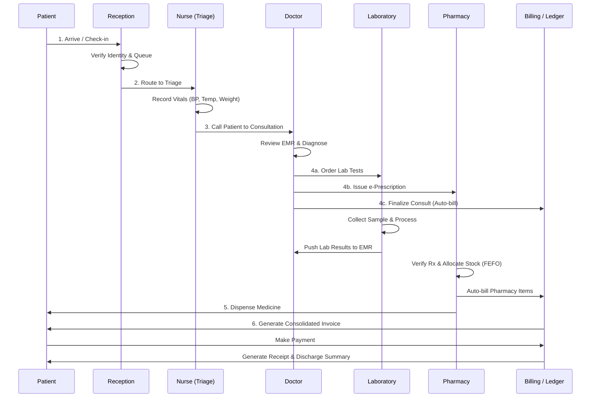
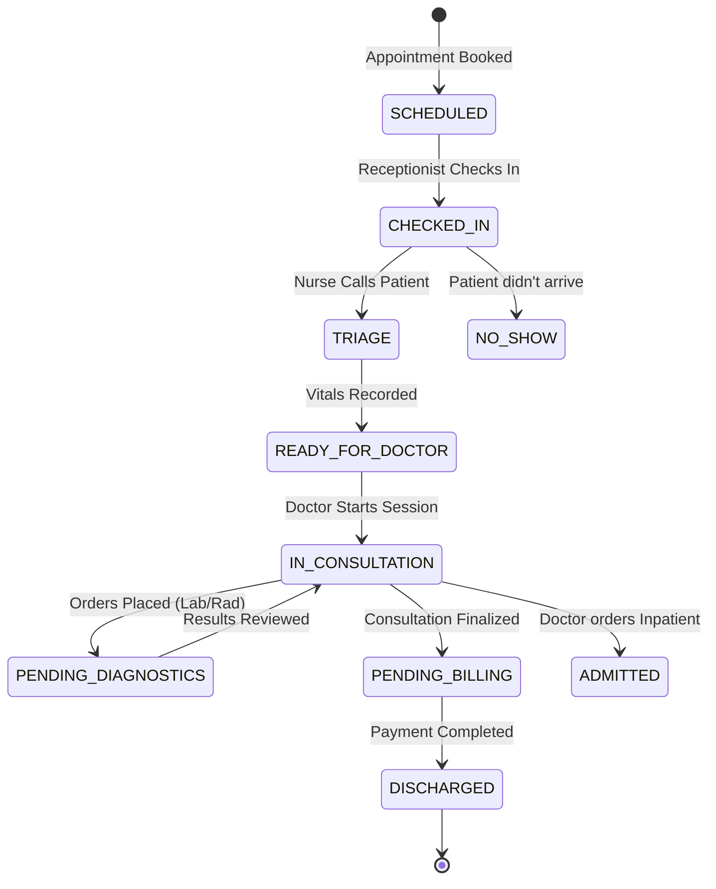

# Patient Management

Based on your clarification that the core focus is a **Hospital Management System (HMS)** encompassing doctors, patients, staff, rooms, labs, and billing, here is the comprehensive **End-to-End Patient Workflow**.

This workflow is designed to eliminate bottlenecks, prevent revenue leakage, and provide a seamless experience for both the patient and the clinical staff. It also leverages the robust backend engines (like the FEFO inventory and immutable ledger) discussed in the architecture to ensure hospital operations are airtight.

---

### 🗺️ The End-to-End Patient Journey (Visual Flow)

---

### 📋 Step-by-Step Workflow Breakdown

#### Phase 1: Access & Registration (Front Desk)

- **Trigger:** Patient books via Mobile App, calls, or walks in.
- **Action (Receptionist):**
    - Search for existing Patient ID (via Phone/Name) or create a new Demographic Profile.
    - Select the required Service (OPD Consultation, Specific Lab Package, or Vaccination).
    - Select Doctor/Department and generate a **Queue Token**.
- **System Automation:**
    - SMS/WhatsApp sent to patient: *"You are token #14. Estimated wait time: 25 mins."*
    - Patient's status changes to `SCHEDULED` or `CHECKED_IN`.

#### Phase 2: Triage & Vitals (Nursing Station)

- **Trigger:** Patient arrives at the clinical floor.
- **Action (Nurse):**
    - Call patient from the digital waiting queue.
    - Record baseline vitals: Blood Pressure, Heart Rate, Temperature, SpO2, Weight, Height.
    - Note preliminary complaints/allergies.
- **System Automation:** Vitals are instantly timestamped and attached to the patient's Electronic Medical Record (EMR) timeline. Status changes to `READY_FOR_DOCTOR`.

#### Phase 3: Clinical Consultation (The Doctor's Workspace)

- **Trigger:** Doctor clicks "Call Next" on their dashboard.
- **Action (Doctor):**
    - **View:** Sees patient history, allergies, and today's vitals on a single screen.
    - **Diagnose:** Selects ICD-10 codes for the diagnosis.
    - **Order Entry (CPOE):**
        - *Orders Labs:* Selects tests (e.g., CBC, Lipid Profile).
        - *Orders Pharmacy:* Writes e-Prescription (Drug, Dosage, Frequency, Duration).
        - *Orders Admission:* If severe, initiates Inpatient Admission request.
    - **Finalize:** Clicks "Complete Consultation".
- **System Automation:**
    - Lab order routes instantly to the Lab Queue.
    - Prescription routes to the Pharmacy Queue.
    - Consultation fee is pushed to the patient's temporary billing cart.

#### Phase 4: Diagnostics & Fulfillment (Parallel Processing)

**Path A: Laboratory Workflow**

1. **Sample Collection:** Nurse/Patient goes to phlebotomy. Lab staff scans the barcode on the tube. Status: `SAMPLE_COLLECTED`.
2. **Processing:** Lab technician runs the test and enters/validates results. Status: `VERIFIED`.
3. **Reporting:** System automatically flags abnormal results (red indicators) and pushes the report to the Doctor's inbox and the Patient's mobile app.

**Path B: Pharmacy Workflow (Powered by Inventory Engine)**

1. **Queue:** Pharmacist sees the e-Prescription.
2. **Clinical Check:** System checks for drug-allergy or drug-drug interactions.
3. **Allocation (FEFO):** Pharmacist clicks "Dispense". The system queries the inventory and **automatically selects the batch closest to expiry** (First-Expired, First-Out) to prevent hospital pharmacy waste.
4. **Handover:** Medicine is handed to the patient. Inventory is atomically deducted, and the cost is pushed to the billing cart.

#### Phase 5: Inpatient / Ward Management (If Admitted)

- **Trigger:** Doctor marks consultation as "Admit to Ward".
- **Action (Admissions/Nurse):**
    - View **Visual Bed Map** (Ward management).
    - Assign an available bed (e.g., Ward A - Room 204 - Bed B).
    - Status changes to `ADMITTED`.
- **Ongoing Care:** Nurses log daily medication administration (eMAR), vitals, and dietary notes.
- **System Automation:** Daily room charges, nursing charges, and consumed consumables (IV fluids, syringes) are automatically added to the patient's running bill every midnight.

#### Phase 6: Billing, Discharge & Follow-Up

- **Trigger:** Doctor discharges the patient (OPD) or signs the Discharge Summary (IPD).
- **Action (Billing/Cashier):**
    - Opens the **Consolidated Invoice**.
    - The system displays all aggregated charges: Consultation + Lab Tests + Pharmacy + Ward/Consumables.
    - Applies insurance claims, discounts, or package deductions.
- **Action (Patient):** Pays via Cash, Card, or Insurance TPA integration.
- **System Automation (The Immutable Ledger):**
    - Payment is recorded.
    - An **immutable journal entry** is created in the financial ledger (cannot be deleted, only reversed if a refund is needed).
    - Discharge summary and lab reports are emailed to the patient.
    - System schedules an automated SMS follow-up: *"How was your recovery? Reply to book your follow-up with Dr. Smith."*

---

### 🔄 Patient Visit State Machine (Status Lifecycle)

To ensure smooth queue management and reporting, every patient visit moves through strict states:

---

### 💡 Key System Automations (The "Magic" for the Buyer)

When presenting this workflow to hospital stakeholders, emphasize these **invisible automations** that save them money and time:

1. **Zero-Loss Charge Capture:** Doctors don't need to "bill" the patient. The moment they order a Lab Test or prescribe a Medicine, the billing engine creates a pending line item. *Revenue leakage drops to near 0%.*
2. **Turnaround Time (TAT) Tracking:** The system tracks exactly how long a lab sample sat in the "collected" state before processing. Management can identify bottlenecks.
3. **Pharmacy Waste Reduction:** By integrating the hospital's pharmacy with the **FEFO Inventory Engine**, the hospital stops losing money on expired medicines sitting on the shelf.
4. **Unified EMR Timeline:** Whether it's a vitals entry by a nurse, a PDF lab report from the machine, or a prescription by the doctor, it all pins to a single, chronological patient timeline. No more hunting through different modules.
5. **Audit-Proof Financials:** Because the billing relies on the **Immutable Ledger**, the hospital CFO knows that the daily revenue report perfectly matches the clinical services rendered, with zero risk of internal tampering or deleted invoices.

Would you like to dive deeper into the **Database Schema (ERD)** specifically mapped to this Patient/Doctor/Room workflow, or the **Role-Based Dashboards** for the Doctor and Nurse?