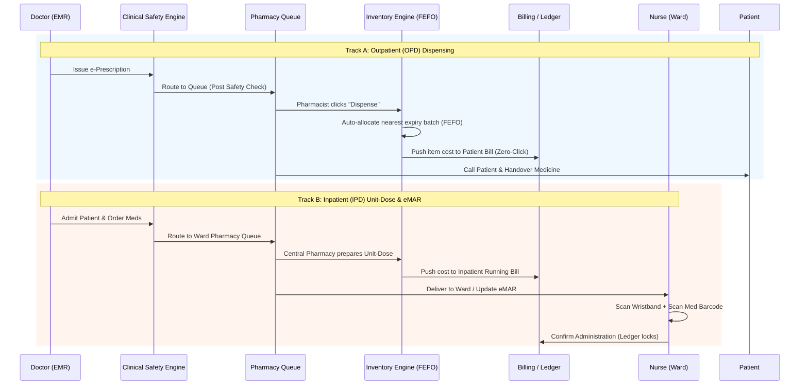

# Pharmacy & Dispensing

In a **Hospital Management System (HMS)**, the Pharmacy module is the critical intersection of **clinical safety, patient experience, and hospital revenue**. Unlike a retail pharmacy, a hospital pharmacy must manage complex workflows for both walk-in outpatients (OPD) and admitted inpatients (IPD), all while maintaining strict batch-level traceability and financial integrity.

By leveraging the robust supply chain engines (like **FEFO Allocation**, **Batch Genealogy**, and the **Immutable Ledger**), the OmniCare HMS Pharmacy module eliminates medication errors, prevents revenue leakage, and ensures 100% regulatory compliance.

Here is the comprehensive **End-to-End Pharmacy & Dispensing Workflow** for both Outpatient and Inpatient scenarios.

---

### 🗺️ The Dual-Track Pharmacy Flow (OPD vs. IPD)

---

### 📋 Step-by-Step Workflow Breakdown

#### Track A: Outpatient (OPD) Dispensing Workflow

*Focus: Speed, accuracy, patient counseling, and instant billing.*

1. **Queue Ingestion & Clinical Safety (CDSS):**
    - The moment the doctor clicks "Sign & Finalize", the prescription hits the **Pharmacy Queue**.
    - **Background Safety Check:** The system instantly checks for drug-allergies, drug-drug interactions, and duplicate therapy. If a critical error is found, the prescription is flagged **RED** and locked until the doctor overrides or changes it.
2. **Smart Allocation (The FEFO Engine ⭐):**
    - The pharmacist opens the prescription and clicks "Prepare".
    - The system queries the inventory and **automatically selects the batch closest to its expiry date** (First-Expired, First-Out).
    - *Value:* The pharmacist doesn't have to guess which box to grab. The system guarantees zero expired medicine reaches the patient, and the hospital eliminates millions in expired write-offs.
3. **Zero-Click Billing & Ledger:**
    - Simultaneously, the cost of the dispensed medicine is atomically pushed to the patient's consolidated billing cart.
    - An **Immutable Ledger Entry** is created: `Inventory Deducted (Batch X) | Financial Credit (Revenue)`. This cannot be deleted, ensuring perfect audit trails.
4. **Labeling & Handover:**
    - The system prints a barcode label with dosage instructions. The pharmacist calls the patient via the digital queue display.

#### Track B: Inpatient (IPD) Dispensing & eMAR Workflow

*Focus: Patient safety, unit-dose accuracy, and continuous ward inventory.*

1. **Medication Orders (Admission):**
    - The doctor admits the patient and enters medication orders (e.g., "IV Antibiotic every 8 hours").
    - Orders are categorized into **Continuous (Long-term)** or **STAT (Immediate)**.
2. **Central Pharmacy Preparation (Unit-Dose):**
    - The Ward Pharmacy receives the order. Instead of sending whole bottles, the pharmacy prepares **Unit-Dose packets** (single pills/ampoules labeled with patient name, drug, dose, and time).
    - Inventory is deducted via FEFO, and the cost is added to the patient's daily running bill.
3. **The eMAR (Electronic Medicine Administration Record):**
    - The medication is delivered to the ward. The Nurse views the **eMAR Dashboard** on a tablet or ward PC.
    - **Closed-Loop Verification:** The nurse scans the **Patient's Wristband Barcode**, then scans the **Medicine Packet Barcode**.
    - *System Action:* If it's the right patient, right drug, right time, the system turns **GREEN** and allows administration. If wrong, a **Hard-Stop Alarm** sounds.
4. **Administration & Ledger Lock:**
    - The nurse clicks "Administer". The system records the exact timestamp, the nurse's digital signature, and locks the ledger entry. *If a patient later claims they didn't receive a drug, the hospital has cryptographic proof of exactly when and by whom it was administered.*

---

### 🔄 Inventory & Ledger Engine (The "Invisible" Backend)

The pharmacy module is powered by the same enterprise-grade supply chain engine used in top-tier distribution networks:

| Engine Feature | How it Works in the Hospital Pharmacy |
| --- | --- |
| **FEFO Allocation** | Automatically forces the dispensing of older batches first. Prevents the "hidden" waste of medicines expiring on the shelf while newer batches are used. |
| **Immutable Ledger** | Every pill dispensed creates an `INSERT`-only ledger record. If a nurse makes a mistake and administers the wrong dose, it is corrected via a *reversing entry*, not by deleting the original record. Auditors love this. |
| **Batch Genealogy** | If the FDA issues a recall for a specific batch of *Amoxicillin*, the system **instantly quarantines** that batch across all OPD shelves, IPD ward stock, and central pharmacy. It flags any patient who was dispensed that batch in the last 30 days. |
| **Ward vs. Central Stock** | Tracks "Central Pharmacy" inventory separately from "Ward Floor Stock" (emergency meds kept on the ward). Transfers between them are audit-tracked. |

---

### 🛑 Exception Handling: Returns & Expiry Management

Hospitals face unique challenges with medication returns. The system handles them with strict financial and clinical controls:

1. **OPD Return (Patient didn't pick up / Doctor cancelled):**
    - Receptionist or Pharmacist clicks "Cancel/Return".
    - **System Action:** The medicine is still in its original sealed packaging. Inventory is instantly restored (reversing the ledger entry), and the patient's bill is credited.
2. **IPD Return (Patient discharged early / Medicine not administered):**
    - Nurse initiates a "Ward Return".
    - **System Action:** The medicine goes into a **QC Hold (Quarantine)** state. It *cannot* be dispensed to another patient until a pharmacist physically inspects it and clears it. Once cleared, it returns to active stock.
3. **Near-Expiry Alerts (Predictive Reordering):**
    - The Analytics Engine monitors all batches. 90 days before a batch expires, it triggers an alert to the Pharmacy Manager to move it to the front of the shelf (FEFO) or initiate a return to the supplier if allowed.

---

### 💡 Key Automations to Pitch to the Hospital CFO & Pharmacy Director

When demonstrating the Pharmacy Module, emphasize these **ROI-driven automations**:

1. **The "FEFO Profit Protector":**
    - *Pitch:* "Hospitals typically lose 1-3% of their pharmacy budget to expired medicines because staff naturally grab the newest boxes. Our system physically prevents this by forcing the dispensing of the nearest-expiry batch via the FEFO engine. This feature alone pays for the HMS subscription."
2. **Zero-Leakage Billing:**
    - *Pitch:* "In legacy systems, nurses administer drugs and manually log them for billing at the end of the shift—resulting in 5% missed charges. In our system, the moment the doctor orders it, or the nurse scans it on the eMAR, the financial ledger is updated atomically. You bill for every single pill that leaves the shelf."
3. **The "One-Click" Recall Quarantine:**
    - *Pitch:* "If a drug manufacturer issues a recall, your pharmacy staff currently spends hours pulling boxes and checking paper records. With our Batch Genealogy engine, you type in the batch number, and the system instantly locks that batch across every ward, OPD, and central store in 3 seconds, protecting your patients and your license."
4. **Closed-Loop eMAR (Malpractice Shield):**
    - *Pitch:* "Our barcode-scanning eMAR ensures the '5 Rights' of medication administration. It provides the hospital administration with cryptographic, time-stamped proof of exactly who gave what to whom, drastically reducing nursing liability and malpractice risks."

Would you like to explore the **Database Schema (ERD)** for the Pharmacy module (Tables for `prescriptions`, `medicine_batches`, `emmar_logs`, `pharmacy_ledger`), or shall we move on to the **Ward & Bed Management Workflow**?