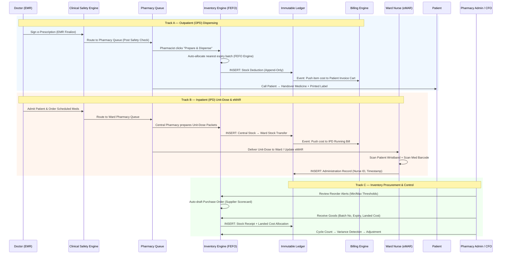
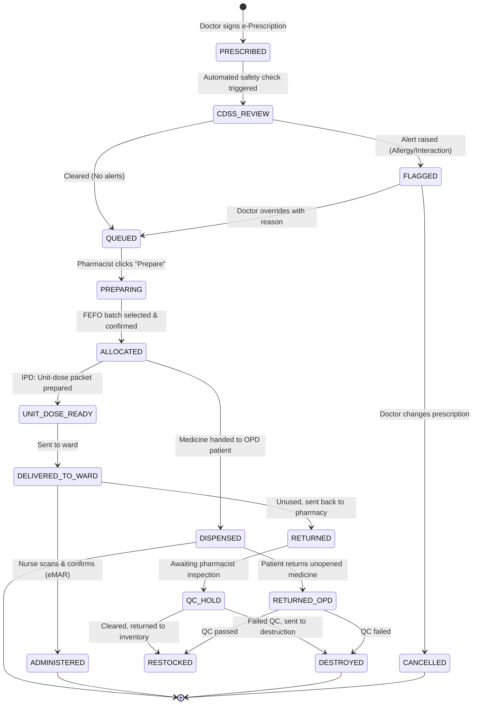

# Pharmacy Workflow

# 🏥 OmniCare HMS — Pharmacy & Dispensing Workflow

In a **Hospital Management System (HMS)**, the Pharmacy module sits at the critical intersection of **clinical safety, patient experience, inventory cost control, and revenue integrity**. Unlike a retail pharmacy, a hospital pharmacy must serve two fundamentally different tracks — **Outpatient (OPD)** walk-up dispensing and **Inpatient (IPD)** ward-level unit-dose administration — while maintaining strict batch-level traceability, regulatory compliance, and zero revenue leakage.

By leveraging the enterprise-grade supply chain engines documented in our platform architecture — **FEFO Allocation**, **Batch Genealogy**, **Immutable Ledger**, **Unified Transactions**, and **Instant Quarantine** — the OmniCare HMS Pharmacy module transforms the hospital pharmacy from a cost center into a precision-controlled, audit-proof operation.

---

## 🗺️ The Dual-Track Pharmacy & Inventory Flow

---

## 📋 Step-by-Step Workflow Breakdown

### Track A: Outpatient (OPD) Dispensing

*Focus: Speed, clinical safety, patient counseling, and instant billing capture.*

#### Step 1: Queue Ingestion & Clinical Decision Support (CDSS)

- The moment the doctor clicks **"Sign & Finalize"** in the EMR, the e-prescription is published as a domain event to the hospital's message bus.
- The **CDSS Engine** intercepts the event and runs real-time safety checks:
    - **Allergy Cross-Check:** "Patient is allergic to Penicillin. Amoxicillin is contraindicated." → *Hard Stop (Red).*
    - **Drug-Drug Interaction:** "Patient is on Warfarin. Prescribing NSAIDs increases bleeding risk." → *Soft Stop (Override with reason required).*
    - **Duplicate Therapy:** "Patient already has an active prescription for Metformin 500mg."
    - **Dosage Guard:** "Prescribed dose exceeds maximum daily limit for patient's weight/age."
- If cleared, the prescription lands in the **Pharmacy Queue** with status `RECEIVED`.

#### Step 2: Smart FEFO Allocation ⭐ *(The ROI Maker)*

- The pharmacist opens the prescription from the queue and clicks **"Prepare"**.
- The **FEFO (First-Expired, First-Out) Allocation Engine** queries all available batches of the prescribed medicine and **automatically selects the batch closest to its expiry date**.
- An interactive **FEFO Allocation Preview** is displayed before committing:
    - *Example:* "Cetirizine 10mg — Allocating 20 units from `BATCH-CETI-001` (Expiry: 2026-09-15) instead of `BATCH-CETI-002` (Expiry: 2027-03-01)."
- The pharmacist confirms. The system atomically:
    1. Deducts stock from the selected batch.
    2. Creates an **Immutable Ledger Entry**: `INSERT | Debit: Pharmacy Inventory | Credit: COGS | Ref: Rx-20260807-0042`.
    3. Pushes the item cost to the patient's consolidated billing cart.

> **Value Proposition:** *"This single feature pays for the software. By enforcing FEFO at the point of dispensing, we eliminate the #1 preventable loss in hospital pharmacy — expired medicine write-offs."*
> 

#### Step 3: Labeling, Counseling & Handover

- The system prints a barcode label with patient name, drug name, dosage instructions, and batch number.
- The pharmacist calls the patient via the digital queue display, provides counseling, and hands over the medicine.
- Status changes to `DISPENSED`. The billing line item is locked.

---

### Track B: Inpatient (IPD) Unit-Dose & eMAR Workflow

*Focus: Patient safety, closed-loop verification, and continuous ward inventory control.*

#### Step 1: Medication Orders on Admission

- The doctor admits the patient and enters medication orders in the EMR:
    - **Continuous Orders:** "IV Ceftriaxone 1g every 12 hours for 5 days."
    - **STAT Orders:** "IV Paracetamol 1g now."
    - **PRN Orders:** "Oral Ondansetron 4mg as needed for nausea."
- Each order triggers a CDSS safety check, then routes to the **Ward Pharmacy Queue**.

#### Step 2: Central Pharmacy Preparation (Unit-Dose System)

- Instead of sending whole bottles to the ward, the Central Pharmacy prepares **Unit-Dose Packets** — individual doses labeled with:
    - Patient Name & MRN
    - Drug Name, Strength, Route
    - Scheduled Administration Time
    - Batch Number & Barcode
- **Inventory Transfer:** Stock moves from `Central Pharmacy` to `Ward Floor Stock` via an internal transfer. The **Immutable Ledger** records: `INSERT | From: Central Store | To: Ward 3 Store | Batch: BATCH-CEF-003 | Qty: 10`.
- The cost is pushed to the patient's **IPD Running Bill**.

#### Step 3: The eMAR (Electronic Medicine Administration Record) ⭐

- The nurse opens the **eMAR Dashboard** on a ward tablet or workstation.
- The eMAR shows a timeline grid: Patient × Drug × Scheduled Time slots.
- **Closed-Loop Verification (The "5 Rights" Check):**
    1. Nurse scans the **Patient's Wristband Barcode**.
    2. Nurse scans the **Unit-Dose Packet Barcode**.
    3. System verifies: Right Patient + Right Drug + Right Dose + Right Route + Right Time.
    4. ✅ **GREEN** → Administration allowed.
    5. ❌ **RED HARD-STOP ALARM** → Mismatch detected. Administration blocked.
- Nurse clicks **"Administer"**. The system records:
    - Exact timestamp
    - Nurse's digital ID and signature
    - Batch number administered
    - An **Immutable Ledger Entry** is created: `INSERT | Administered | Nurse ID: N-204 | Patient: P-8891 | Drug: Ceftriaxone 1g | Batch: BATCH-CEF-003 | Time: 2026-08-07T14:02:00Z`.

> **Value Proposition:** *"Our closed-loop eMAR provides cryptographic, time-stamped proof of exactly who gave what to whom and when. This is the hospital's strongest defense against nursing malpractice claims."*
> 

---

### Track C: Pharmacy Inventory Procurement & Control

*Focus: Ensuring the pharmacy never runs out of critical medicines while minimizing waste and cost.*

#### Step 1: Reorder Alerts & Predictive Reordering

- The system continuously monitors stock levels against configurable **Min/Max thresholds** per medicine.
- When stock drops below the reorder point, an alert surfaces on the **Pharmacy Admin Dashboard**.
- The **Analytics Service** (Prophet time-series model) forecasts consumption patterns and predicts stock-out dates: *"Amoxicillin 500mg will stock out in 12 days at current consumption rate."*
- One click drafts a **Purchase Order** to the best-ranked supplier (using the **Supplier Scorecard** — on-time delivery, fulfillment accuracy).

#### Step 2: Goods Receipt & Landed Cost Allocation

- When the supplier delivers, the pharmacy storekeeper receives the goods:
    - Enters **Batch Number, Expiry Date, Quantity, Purchase Price**.
    - Allocates **Landed Costs** (freight, customs, insurance) across batches for true unit cost visibility.
- The system atomically creates:
    1. A new `StockBatch` record.
    2. An **Immutable Ledger Entry**: `INSERT | Debit: Pharmacy Inventory Asset | Credit: Accounts Payable | Ref: GRN-20260807-012`.
- The batch is now available for FEFO allocation.

#### Step 3: Cycle Counts & Variance Detection

- Scheduled physical counts compare counted quantities vs. system quantities per batch/location.
- **Variance Detection** flags discrepancies for investigation.
- Adjustments are made via **reversing ledger entries** (never by editing the original record).

#### Step 4: Returns Management

- **OPD Returns:** Patient returns unopened medicine. Pharmacist initiates return → QC check → If passed, stock is re-shelved and the patient's bill is credited via a reversing ledger entry.
- **IPD Returns:** Nurse returns unused unit-dose packets from a discharged patient. Items go into **QC Hold (Quarantine)** state. A pharmacist must inspect and clear them before they re-enter active stock.

#### Step 5: Destruction Management (Controlled Disposal)

- Expired or damaged medicines are moved to **Quarantine** state.
- The Pharmacy Admin initiates the **Destruction Workflow**:
    1. Selects expired batches.
    2. **Dual Witness Sign-off** required (Pharmacist + Infection Control Officer).
    3. System generates a **Destruction Certificate** (PDF).
    4. An **Immutable Ledger Entry** writes off the stock: `INSERT | Debit: Destruction Expense | Credit: Pharmacy Inventory | Ref: DEST-20260807-003`.

> **Value Proposition:** *"When health inspectors or drug regulators arrive, you hand them the destruction certificates and the immutable ledger trail. Every expired pill is accounted for, witnessed, and documented."*
> 

---

## 🛡️ The "Killer Feature": Instant Drug Recall Quarantine

- **Scenario:** The FDA or manufacturer issues a recall for `BATCH-CETI-001` due to contamination.
- **The OmniCare Action:** The Pharmacy Admin opens the **Recalls Page**, enters the batch number, and clicks **"Initiate Recall"**.
- **In seconds, the system:**
    1. **Quarantines** all remaining stock of `BATCH-CETI-001` in the Central Pharmacy.
    2. **Quarantines** all remaining stock in every Ward Floor Stock location.
    3. **Flags** the batch on every nurse's eMAR dashboard with a **RED "DO NOT ADMINISTER"** alert.
    4. **Identifies** every patient who was dispensed or administered this batch in the last 30 days via the **Batch Genealogy Tree**.
    5. **Generates** a recall notification list for the Medical Director to contact affected patients.

> **Value Proposition:** *"We turn a weeks-long manual recall crisis — phone calls, spreadsheet checks, ward-by-ward searches — into a 3-second automated lockdown. This is a direct patient-safety feature."*
> 

---

## 🔄 Prescription & Dispensing State Machine

---

## 💡 Key Automations to Pitch to Hospital Leadership

| Stakeholder | Pitch Point |
| --- | --- |
| **CFO** | *"The FEFO Allocation Engine alone pays for the HMS. Hospitals typically lose 1-3% of pharmacy budget to expired write-offs. Our system physically prevents this by forcing nearest-expiry dispensing. Zero-click billing capture ensures you bill for every pill that leaves the shelf."* |
| **Medical Director** | *"The CDSS safety net catches lethal drug interactions and allergy mismatches before the prescription reaches the pharmacy. The closed-loop eMAR ensures the 5 Rights of medication administration with cryptographic proof."* |
| **Pharmacy Director** | *"Predictive reordering with Prophet forecasting tells you 12 days before you stock out. The Supplier Scorecard auto-routes POs to your best-performing vendors. Cycle counts with variance detection keep your inventory accurate."* |
| **Infection Control** | *"The Instant Recall Quarantine locks a contaminated batch across every ward, OPD shelf, and central store in 3 seconds. The Dual-Witness Destruction workflow ensures compliant disposal with full audit certificates."* |
| **CIO / IT** | *"Every transaction writes to an append-only Immutable Ledger. Corrections are reversing entries, never deletions. The system is tamper-evident by design and ready for HIPAA, JCI, and regulatory audits."* |

---

Would you like to explore the **Database Schema (ERD)** for the Pharmacy module (Tables for `prescriptions`, `prescription_items`, `medicine_batches`, `emmar_logs`, `pharmacy_ledger`, `destruction_records`), or shall we move on to the **Ward, Bed & Inpatient Management Workflow**?