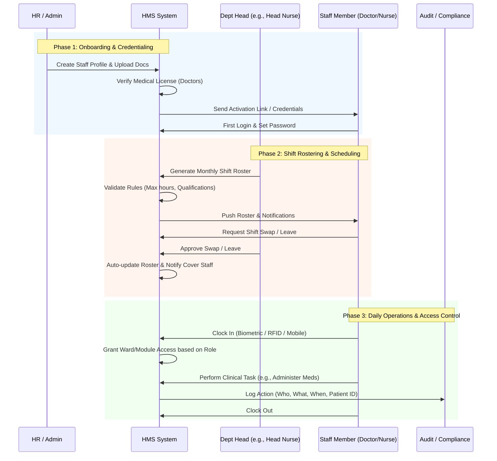
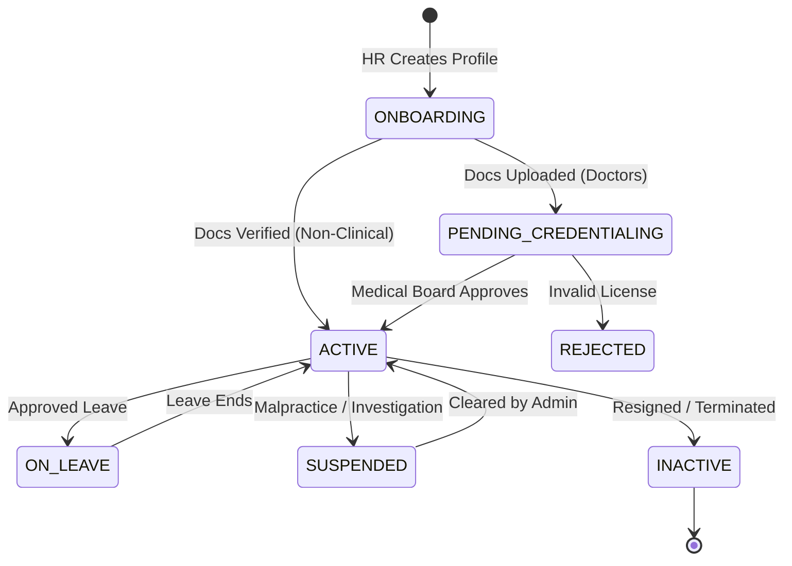

# Staff Management

In a **Hospital Management System (HMS)**, Staff Management is vastly more complex than in standard corporate software. It involves strict regulatory credentialing (especially for doctors), 24/7 shift rostering, ward-level data isolation, and rigorous audit trails for patient safety.

Here is the comprehensive **End-to-End Staff Management Workflow** tailored specifically for a hospital environment.

---

### 🗺️ The Staff Lifecycle & Operations Flow

---

### 📋 Step-by-Step Workflow Breakdown

#### Phase 1: Onboarding & Credentialing (The Gatekeeper)

*Hospitals cannot allow just anyone to access clinical systems. Credentialing is critical.*

- **For Clinical Staff (Doctors, Nurses, Lab Techs):**
    1. **Application:** HR or Dept Head creates a profile and uploads mandatory documents (Medical License, Degree, Certifications).
    2. **Verification:** The system flags licenses nearing expiry. For doctors, the Medical Board/Admin must approve the credentialing before they can prescribe.
    3. **Activation:** Once approved, the system generates a secure login. The staff member completes their profile (signature capture for e-prescriptions, department assignment).
- **For Non-Clinical Staff (Receptionists, Billing, Housekeeping):**
    1. HR creates the profile, assigns a basic role (e.g., `ROLE_RECEPTIONIST`), and links them to a specific facility/branch.
- **System Automation:** Auto-sends welcome emails with secure onboarding links. Triggers a 30-day alert before any medical license expires.

#### Phase 2: Role Assignment & Granular Access Control (RBAC)

*Security in a hospital means ensuring a nurse in Ward A cannot see the psychiatric records of a patient in Ward B.*

- **Role Mapping:**
    - `DOCTOR`: Read/Write EMR, Prescribe, Order Labs, View assigned patients.
    - `NURSE`: Record Vitals, Administer Medications (eMAR), View assigned ward patients.
    - `PHARMACIST`: Verify Prescriptions, Dispense, Manage Pharmacy Inventory.
    - `RECEPTIONIST`: Book Appointments, Register Patients, Generate Bills.
- **Data Scoping (Ward/Department Level):**
    - The system applies **Row-Level Security**. A nurse logged into the "ICU" dashboard will *only* query and see ICU patients. If they try to access a general ward patient via URL manipulation, the API returns `403 Forbidden`.
- **E-Signature Binding:** Every clinical action (prescribing, administering) requires the staff member to enter their PIN or use biometric auth, legally binding their identity to the action.

#### Phase 3: Shift Rostering & Roster Management (The Operational Core)

*Hospitals run 24/7. Manual scheduling in Excel is a massive pain point for Head Nurses and Administrators.*

- **Roster Creation:** Dept Heads use a drag-and-drop calendar to assign Morning (M), Evening (E), Night (N), and Off (O) shifts.
- **Automated Compliance Checks:** Before publishing, the system validates:
    - *Safety Rule:* No nurse is scheduled for a Night shift immediately followed by a Morning shift.
    - *Skill Mix Rule:* Every shift must have at least one Senior Nurse and one Junior Nurse.
- **Shift Swapping & Leave:**
    - Staff requests a leave or swap via the mobile app.
    - System checks if the covering staff has the required qualifications and isn't exceeding max weekly hours.
    - Dept Head approves with one click. Roster updates instantly, and both staff receive push notifications.

#### Phase 4: Attendance & Time Tracking

- **Clock-In/Out:** Staff clock in via Biometric scanners at ward entrances, RFID badge taps, or Geo-fenced mobile app check-ins.
- **Late/Absentee Tracking:** If a doctor hasn't clocked in 15 mins before their first OPD appointment, the system alerts the Clinic Manager.
- **Payroll Integration:** At month-end, the system exports actual hours worked, night-shift differentials, and overtime to the payroll/finance module.

#### Phase 5: Daily Clinical Operations & Auditability

- **The "Who Did What" Trail:**
    - Doctor A prescribes Paracetamol.
    - Nurse B receives the task on their eMAR (Electronic Medicine Administration Record).
    - Nurse B scans the patient's wristband and the medicine barcode, then clicks "Administer".
    - **Audit Log Records:** `[Timestamp] | [Nurse B ID] | [Administered Med X] | [Patient Y] | [Ward Z]`.
- This immutable trail is mandatory for **JCI (Joint Commission International)** and **HIPAA** compliance.

#### Phase 6: Offboarding & Revocation (Security First)

- **Immediate Revocation:** When HR marks a staff member as "Terminated" or "Resigned", the system instantly:
    1. Invalidates all active JWT tokens (forces immediate logout).
    2. Removes them from all future shift rosters.
    3. Reassigns their active patients to the Dept Head or another doctor.
- **Historical Preservation:** The staff member's name remains on past prescriptions and audit logs (for legal/medical history), but their account is locked, and their digital signature is marked as `REVOKED`.

---

### 🔄 Staff Status State Machine

---

### 💡 Key Automations to Pitch to Hospital Administrators

When demonstrating the Staff Module to the **Hospital CEO or HR Director**, highlight these "invisible" automations:

1. **The "No-Ghost-Worker" Payroll:** By integrating biometric clock-ins with the shift roster, the system ensures staff are only paid for shifts they actually worked and were scheduled for, eliminating payroll leakage.
2. **Automated License Expiry Alerts:** The system prevents a doctor with an expired medical license from logging into the EMR or prescribing medication. The system auto-blocks their clinical actions and alerts the Medical Director. *This protects the hospital from massive malpractice liabilities.*
3. **Smart Handover Reports:** At the end of a shift, the system automatically generates a "Handover Summary" for the incoming nurse, highlighting critical patients, pending lab results, and new admissions, reducing shift-change communication errors.
4. **Zero-Trust Ward Isolation:** Emphasize that staff members physically cannot access data outside their assigned department. If a nurse tries to look up a VIP patient in a different ward without authorization, the system blocks it and logs the attempt.

Would you like to see the **Database Schema (Tables)** specifically designed for this Staff, Shift, and Attendance management, or should we move on to the **Ward & Bed Management Workflow**?