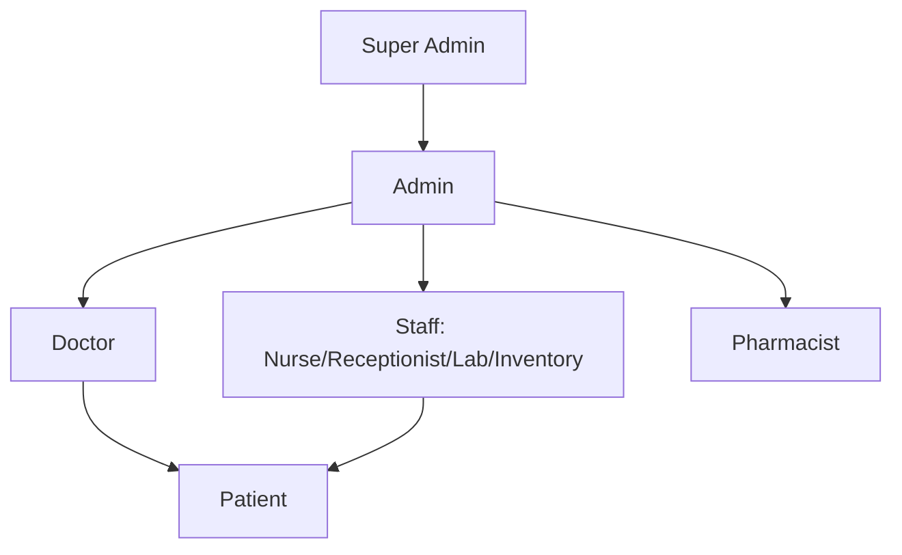
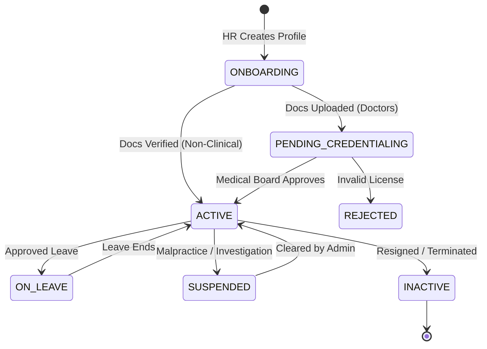
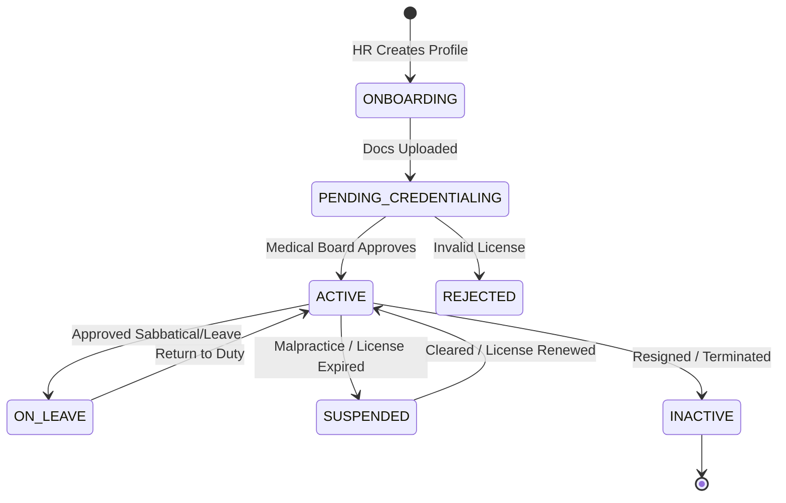
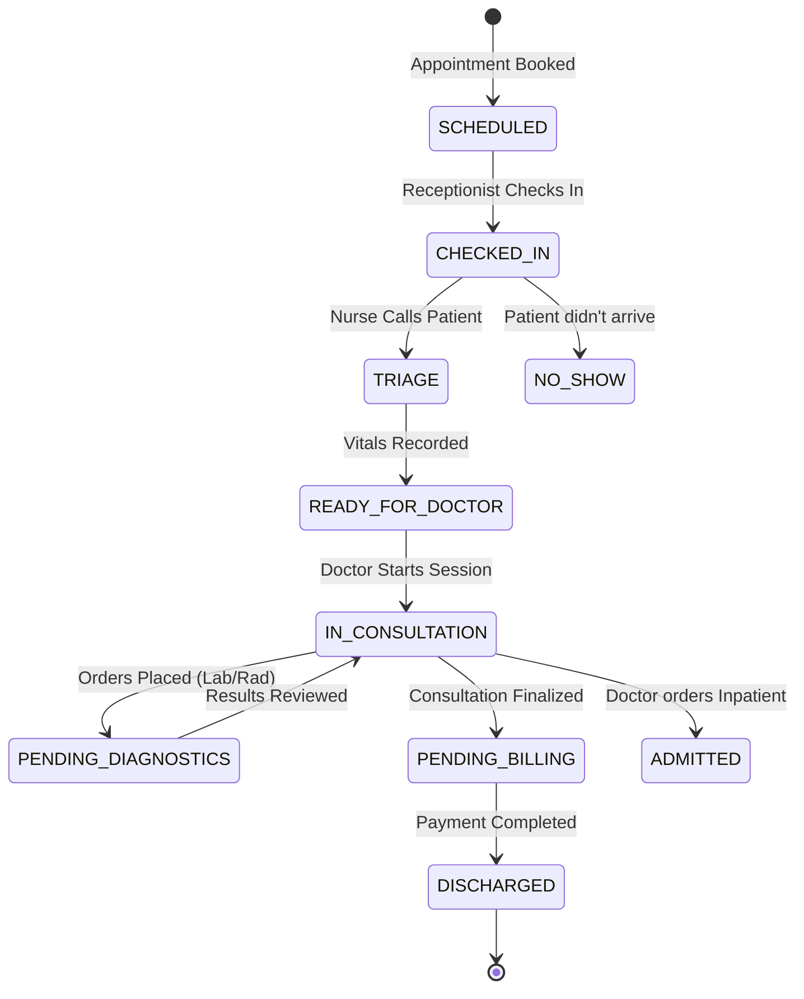
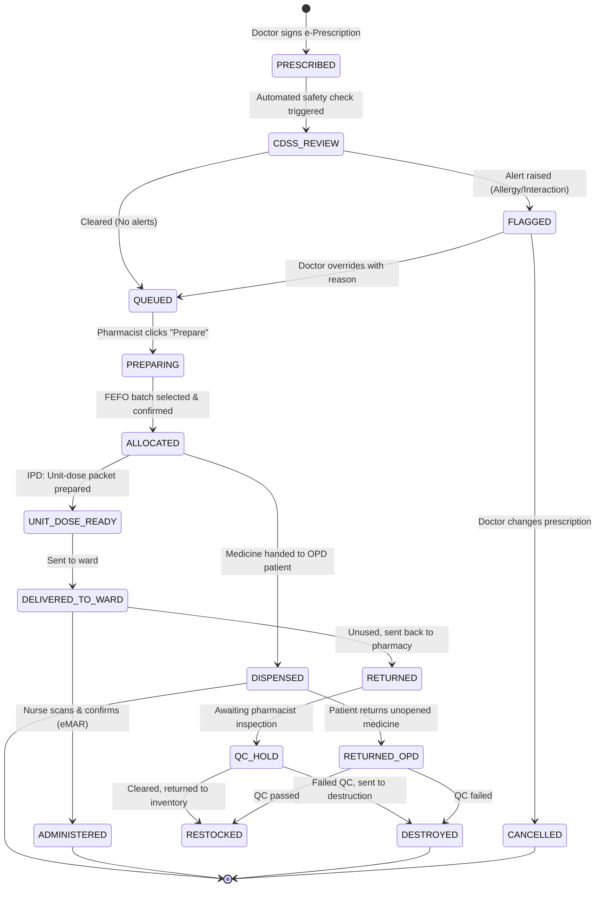
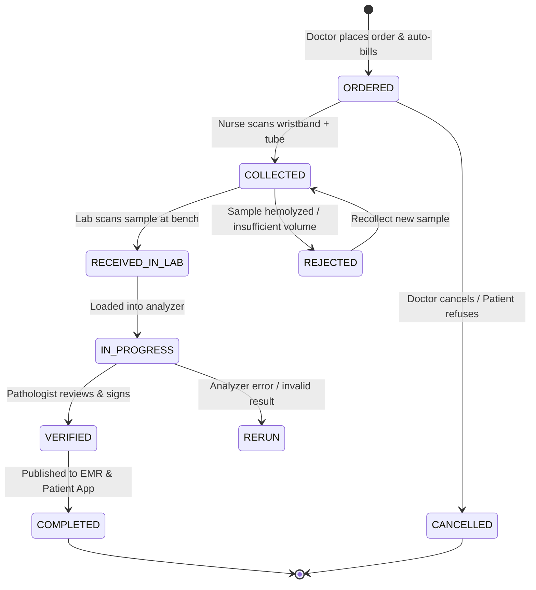
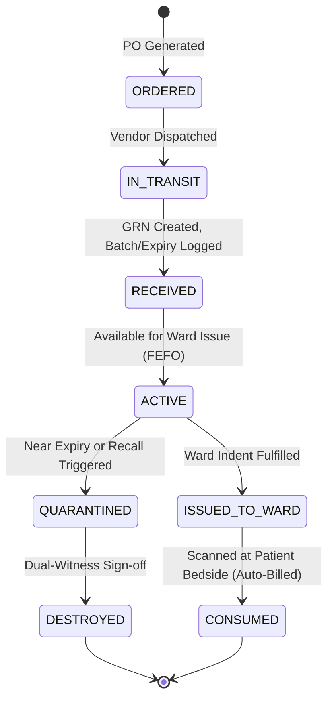
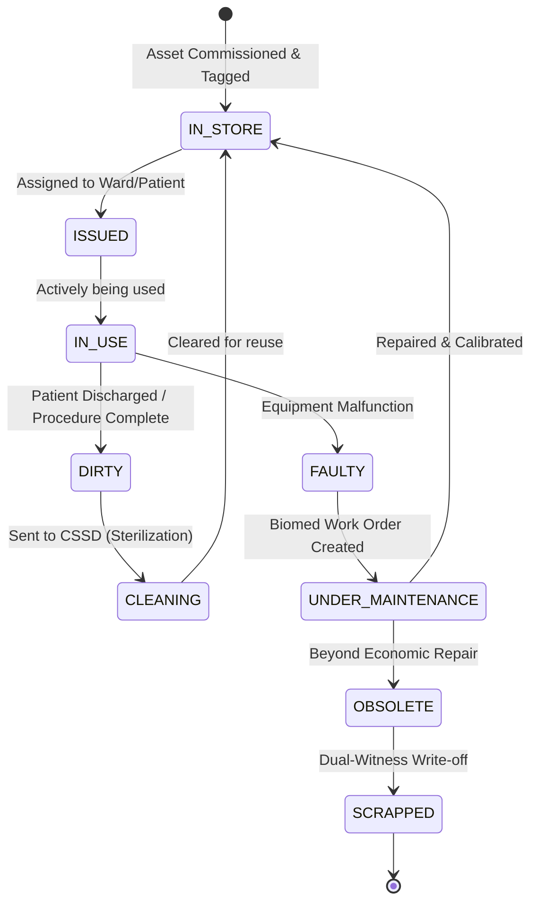
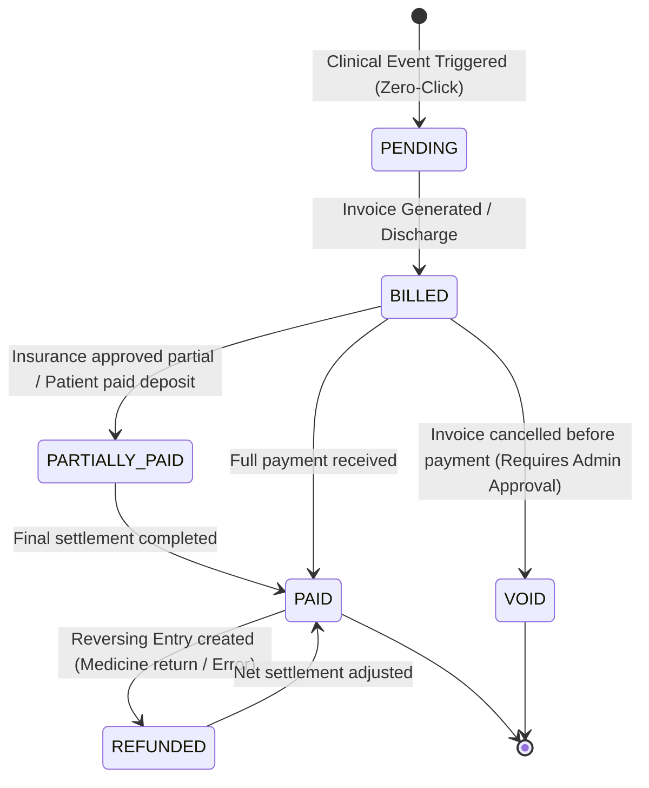

# Workflows

### Role Hierarchy

### 3. Role Permissions Matrix

| Module | Super Admin | Admin | Doctor | Receptionist | Pharmacist | Lab Staff | Inventory | Patient |
| --- | --- | --- | --- | --- | --- | --- | --- | --- |
| **System Config** | Full | Read | - | - | - | - | - | - |
| **User/Staff Mgmt** | Full | Full | - | - | - | - | - | - |
| **Doctor Approval** | Full | Full | Read(Own) | - | - | - | - | - |
| **Appointments** | Read | Full | Manage(Own) | Book/Cancel | - | - | - | Book(Own) |
| **Consultations** | Read | Read | Full (Own) | - | - | - | - | Read(Own) |
| **Pharmacy/Inventory** | Read | Read | Read | - | Full | - | Full | Read(Own) |
| **Laboratory** | Read | Read | Req/View | - | - | Full | - | View(Own) |
| **Billing/Payments** | Read | Full | View | Generate | Generate | - | - | Pay/View |

### 🔄 Staff Status State Machine

---

### 🔄 Doctor Account & Status State Machine

---

### 🔄 Patient Visit State Machine (Status Lifecycle)

To ensure smooth queue management and reporting, every patient visit moves through strict states:

---

## 🔄 Pharmacy (Prescription & Dispensing State Machine)

---

### 🔄 Lab Order State Machine

---

## 🔄 Inventory State Machines

### Consumable / Batch State Machine

### Reusable Asset State Machine

---

### 🔄 Invoice & Payment State Machine

---
